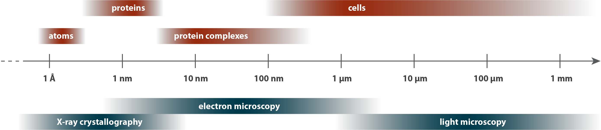
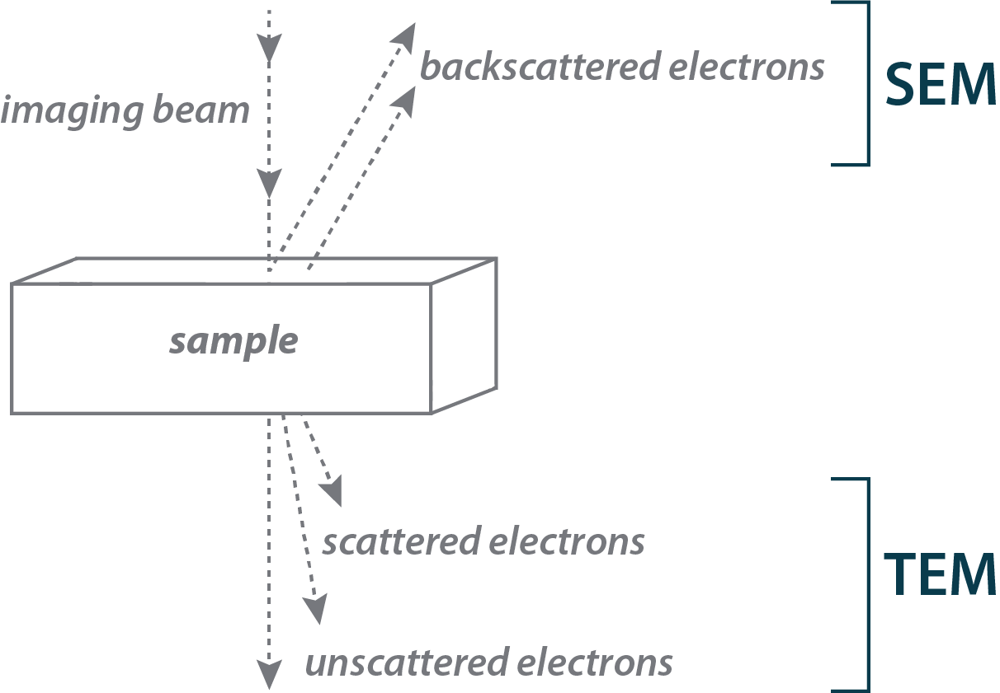
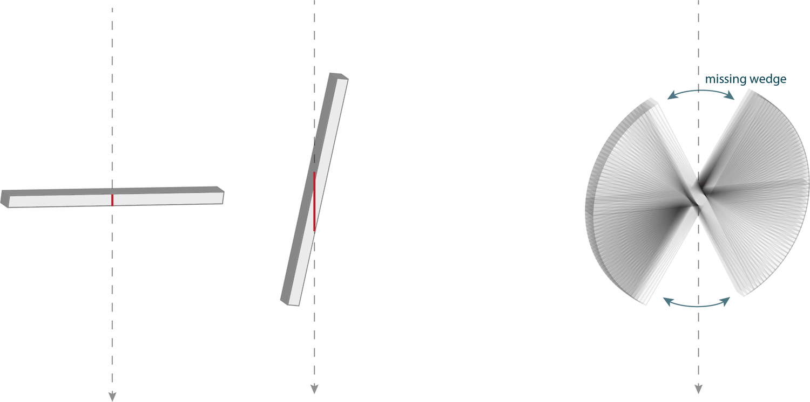
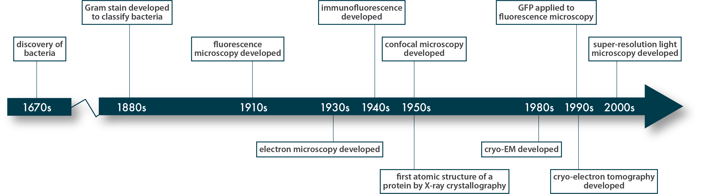

# Methods
> “No doubt, man will continue to weigh and to measure, watch himself grow, and his Universe around him and with him, according to the ever growing powers of his tools.”
- Albert Claude [@claude1974]

## Light Microscopy
To understand a picture, it helps to know how it was made. So before we start looking at the structures of cells, let us quickly cover some of the techniques we use to see them.

Cell biology occurs over a vast scale, from angstrom-level (0.1 nm) rearrangements of molecules inside cells to millimeter-level (1,000,000 nm) interactions between cells. Different tools of structural biology cover different ranges of this scale, complementing one another to provide a more complete view [Schematic: Structural biology toolkit](#Structural_biology_toolkit). To discuss them, we will start at the “big” end of the scale and work our way down, using a bacterial motility appendage called the flagellum (discussed in Chapter 6) as our guide.

Bacteria and archaea are, with very few exceptions, invisible to our eyes. As you can see with these *Staphylococcus aureus* being chased through a field of human blood cells by an immune cell, they are orders of magnitude smaller even than eukaryotic cells. As a consequence, they were unknown to us until about 350 years ago, in the seventeenth century, when Antonie van Leeuwenhoek created the first microscopes capable of revealing such tiny cells. The simplest microscope is a magnifying glass which, combined with the lens of your eye, produces a magnified image on your retina. A compound microscope has two or more lenses, whose magnifications multiply, and this is what we commonly mean when we refer to a “light microscope.”

The cells here were imaged by **light microscopy**, captured on film by David Rogers in the 1950s [@hillInternet]. They illustrate how light microscopy can reveal general properties, such as the shape, of cells.

(ref:1-1) [Staphylococcus aureus](#tree) Collected by: [David Rogers](#david_rogers) Movie DOI: [10.22002/D1.1463](https://doi.org/10.22002/D1.1463)

```{R 1-1, echo=FALSE, screenshot.alt='movie_stills/1_1.png' , fig.cap= '(ref:1-1)'}
if(offline==TRUE){
library(embedvideo)
embedvideo('videos/1_1_Saureus_480p.mp4')
} else {
library(doivideo)
doivideo('10.22002/D1.1463',0,'movie_stills/1_1.png')}
```

### Schematic: Structural biology toolkit {-#Structural_biology_toolkit}
```{R}

```

Cell biology occurs on a length scale that spans seven orders of magnitude. Different visualization techniques cover various sections of this span, as shown here with a few examples. Keep in mind that there are more techniques than these; we touch only on those you will see in the coming pages.

## Fluorescence Light Microscopy
The addition of **fluorescence** to light microscopy allows us to look not just *at* cells, but *for* things inside them. Specific cellular components can be fluorescently labeled, with a stain or antibody that binds a particular molecule. Alternatively, a protein of interest can be genetically linked to a fluorescent protein such as Green Fluorescent Protein (GFP, isolated from a bioluminescent jellyfish off the Pacific coast in the 1970s and adapted as a revolutionary molecular biology tool in the 1990s). While tagging a protein can sometimes change its properties (e.g. affecting its function or altering its localization), this technique often enables us to identify where in the cell a protein is found, and what it might be doing there.

As an example, this movie from Howard Berg’s lab [@bergInternet] [@turner2000] shows *Escherichia coli* cells stained by a fluorescent dye that binds to and highlights their flagella – long, thin appendages that propel them through their environment. (We will discuss this and other ways cells move in Chapter 6.)

(ref:1-2) [Escherichia coli](#tree) Collected by: [Howard Berg](#howard_berg) Movie DOI: [10.22002/D1.1464](https://doi.org/10.22002/D1.1464)

```{R 1-2, echo=FALSE, screenshot.alt='movie_stills/1_2.png' , fig.cap= '(ref:1-2)'}
if(offline==TRUE){
library(embedvideo)
embedvideo('videos/1_2_Ecoli_480p.mp4')
} else {
library(doivideo)
doivideo('10.22002/D1.1464',0,'movie_stills/1_2.png')}
```

## Scanning Electron Microscopy
While fluorescence allows us to highlight subcellular structures, we still cannot resolve much of their detail. This is because the resolution of microscopy is limited by the wavelength of the imaging beam. For light microscopy, the wavelength of the photons limits the resolution to a few hundred nanometers (more powerful for higher-energy blue light and less for lower-energy red). This resolving power is on the order of the width of many bacterial and archaeal cells. There are some technical “super-resolution” tricks to more finely pinpoint fluorescent molecules, but the overall subcellular details of bacteria and archaea are beyond the resolution of light microscopy.

One way to get around the resolution barrier is to use an imaging beam of higher-energy/shorter-wavelength particles. The discovery in the early 1900s that electrons have wave-like properties, and the subsequent realization that they can be focused by a “lens” consisting of a toroidal magnetic field, led to the development of **electron microscopy (EM)** in the 1930s.

There are two main electron microscopy approaches [Schematic: Electron microscopy modes](#Electron_microscopy_modes). In **Scanning Electron Microscopy (SEM)**, we detect electrons that are scattered backward from the sample, producing an image of the surface of the sample. The *Shewanella oneidensis* cells you see here were imaged by SEM. Note the magnified details of the cells’ shape and flagella compared to the light microscopy you just saw.

(ref:1-3) [Shewanella oneidensis](#tree) Collected by: [Sahand Pirbadian](#sahand_pirbadian) Movie DOI: [10.22002/D1.1465](https://doi.org/10.22002/D1.1465)

```{R 1-3, echo=FALSE, screenshot.alt='movie_stills/1_3.png' , fig.cap= '(ref:1-3)'}
if(offline==TRUE){
library(embedvideo)
embedvideo('videos/1_3_Soneidensis_480p.mp4')
} else {
library(doivideo)
doivideo('10.22002/D1.1465',0,'movie_stills/1_3.png')}
```

### Schematic: Electron microscopy modes {-#Electron_microscopy_modes}
```{R}

```


## Transmission Electron Microscopy
In **Transmission Electron Microscopy (TEM)**, we detect electrons that have interacted with atoms in the sample as they passed through it, producing a “projection” image of the 3D object onto a 2D plane, similar to a medical X-ray image. This shows details throughout the cell, not just on the surface.

Electron microscopy, whether SEM or TEM, relies on the interactions of electrons with biological material to create an image. These interactions, however, also present some problems. First, they damage the sample, so exposure has to be limited, which in turn limits the contrast of images, or how much signal we see relative to noise. Second, electrons interact not just with the sample, but also with anything else in their path, so imaging has to be conducted in a vacuum. This is problematic for biological material, which is mostly water that instantly boils away in a vacuum. To circumvent these problems, we can dehydrate samples to remove the water (changing the structure in the process) and coat them with metal to increase electron dose tolerance and contrast. The *Shewanella oneidensis* cells you saw on the last page were coated with platinum before imaging. In TEM, samples are often coated with a “negative stain” such as uranyl acetate; the electron-dense (dark in an image) metal pools around the sample, leaving the interior lighter and thereby creating a negative image. This *S. oneidensis* cell was negative-stained this way before imaging. The resulting projection image again shows the shape of the cell and its flagellum, but not many internal details.

There are more elaborate (and structure-altering) sample preparation methods for TEM, involving "fixing" the sample by chemical crosslinking or freezing under high pressure, dehydrating it, embedding it in resin, staining it, and slicing it into thin sections. With these methods, electron microscopists were able to discover many details of eukaryotic cells such as their internal organelles. Bacteria and archaea are much smaller, though, and lack many robust prominent structures like organelles. As a result, until the twenty-first century, we thought bacteria and archaea were structurally unexciting, little more than water balloons filled with small molecules. How wrong we were.

(ref:1-4) [Shewanella oneidensis](#tree) Collected by: [Mohammed Kaplan](#mohammed_kaplan) Movie DOI: [10.22002/D1.1466](https://doi.org/10.22002/D1.1466)

```{R 1-4, echo=FALSE, screenshot.alt='movie_stills/1_4.png' , fig.cap= '(ref:1-4)'}
if(offline==TRUE){
library(embedvideo)
embedvideo('videos/1_4_Soneidensis_480p.mp4')
} else {
library(doivideo)
doivideo('10.22002/D1.1466',0,'movie_stills/1_4.png')}
```

## Cryogenic Electron Microscopy
We are able to visualize the native structure of bacterial and archaeal cells thanks to a breakthrough in TEM sample preparation. Instead of getting rid of the water, why not just freeze it, since ice sublimates very slowly in a vacuum? The problem is that water expands as it freezes into crystalline ice, damaging the cell in the process. But in the 1980s scientists discovered that freezing a sample quickly enough (done by rapidly plunging a small volume into a very efficient cryogen like liquid ethane) creates a very different kind of ice. The water molecules are immobilized so abruptly that they do not have a chance to find binding partners to form a crystal. The result, called “vitreous” ice for its glass-like properties, preserves cells in their native, fully-hydrated state. The frozen sample can then be inserted directly into the vacuum of the TEM without needing additional treatment or staining. This technique is called **cryogenic electron microscopy**, or **cryo-EM**.

Here you see a projection image of a *Caulobacter crescentus* cell imaged by cryo-EM. Let’s quickly go through how it was prepared. First a drop of culture was placed onto an EM grid. Instead of the glass slides used to support samples in a light microscope, EM sample supports are small circular grids of metal, ~3 mm across, overlaid by a thin mesh of carbon with 2 µm-wide holes. Excess liquid was then blotted away with paper, leaving a thin film of sample across the grid. The grid was then plunged into a cryogen, and the frozen sample was imaged in a special TEM that kept the sample in cold conditions (near the temperature of liquid nitrogen, approximately -190ºC) so that the vitreous ice did not warm and transition to a more damaging (and opaque) crystalline state. In this image, you can see the edge of one of the holes in the carbon mesh of the grid; note the slightly increased clarity in the hole where there is nothing but culture media compared to the region covered by an additional layer of carbon. Whenever possible, we choose to image cells lying at least partially in holes. You will also notice many small dark circles – these are gold beads that were added to the sample; you will see why on the next page.

With cryoEM, we can start to see the true structure of cells. Compared to the images you have already seen, note the added level of detail visible here, including the cell’s multi-layered envelope, and the braided texture of its flagellum.

(ref:1-5) [Caulobacter crescentus](#tree) Collected by: [Steven Wang](#steven_wang) Movie DOI: [10.22002/D1.1467](https://doi.org/10.22002/D1.1467)

```{R 1-5, echo=FALSE, screenshot.alt='movie_stills/1_5.png' , fig.cap= '(ref:1-5)'}
if(offline==TRUE){
library(embedvideo)
embedvideo('videos/1_5_Ccrescentus_480p.mp4')
} else {
library(doivideo)
doivideo('10.22002/D1.1467',0,'movie_stills/1_5.png')}
```

## Cryogenic Electron Tomography
To truly understand a three-dimensional object, we need to be able to visualize it in three dimensions. To do that, we can use **tomography** (from the Greek for “writing slices”). The process may be familiar from medical Computed Tomography, or CT, scans. Simply, the object is imaged from different angles (in a CT scan, the camera moves around the patient; in our case we keep the imaging path constant and simply rotate the small sample). This produces a “tilt-series” of projection images that can be digitally processed into a 3D reconstruction of the object–a tomogram. To do the reconstruction, we need to be able to precisely align the images, which is difficult because of the low contrast from cryoEM samples (unstained and sensitive to exposure).  This is where the gold beads come in. As you saw on the previous page, they provide clear markers in the images to guide the alignment.

Here you see a tomogram of a *Caulobacter crescentus* cell, which we view as a series of slices scanning (or “writing”) from bottom to top. Note the further level of detail that this technique provides, separating the cell’s structures into their three-dimensional locations. We can also rotate the tomogram and slice along a different axis to view structures from different angles, although not all angles are visible [Schematic: Missing wedge](#Missing_wedge).

Since the early 2000s, cryoET has transformed our understanding of microbial cells, revealing their structural richness and diversity, as you will see in the chapters that follow.

(ref:1-6) [Caulobacter crescentus](#tree) Collected by: [Steven Wang](#steven_wang) Movie DOI: [10.22002/D1.1468](https://doi.org/10.22002/D1.1468)

```{R 1-6, echo=FALSE, screenshot.alt='movie_stills/1_6.png' , fig.cap= '(ref:1-6)'}
if(offline==TRUE){
library(embedvideo)
embedvideo('videos/1_6_Ccrescentus_480p.mp4')
} else {
library(doivideo)
doivideo('10.22002/D1.1468',0,'movie_stills/1_6.png')}
```

### Schematic: Missing wedge {-#Missing_wedge}
```{R}

```

Think again about how a tilt-series is made: by taking images from different angles. If we could tilt the sample all the way to 90º, we would have information from every angle. But the sample gets effectively thicker as we tilt it, since the beam has to pass through more and more of the surrounding material. This effect usually becomes prohibitive beyond 60º, so a typical tilt-series spans only ~2/3 of the possible angles, leaving a “missing wedge” of information corresponding to those high tilt angles, as you can see in this diagram. The missing wedge blurs densities in the direction of the imaging beam, so in practice it means that if we look at a cross-section of a cell, we cannot trace thin features like membranes all the way around. You will see an example of this effect in Chapter 5–FtsZ.

## Sub-Tomogram Averaging
What if we want to zoom in further to examine a particular structure more closely? While in theory electron microscopy can resolve atoms, in practice the resolution is limited by many factors including radiation sensitivity and the thickness of the sample. For relatively thick samples like the (small) bacterium on the last page, we can achieve ~5 nm resolution, enough to see the shapes and arrangement of large macromolecular complexes. To boost our resolving power further, we can gather strength in numbers. By averaging multiple copies of a structure, either from the same tomogram, or from multiple cells in different tomograms, we can build up the signal relative to the noise. Here you see an example of this approach, called **sub-tomogram averaging**, applied to the motor that spins the flagellum. Hundreds of *Campylobacter jejuni* cells were imaged by cryoET and their individual flagellar motors were extracted from the resulting tomograms and averaged to produce a higher-resolution view [@beeby2016]. Note how densities that vary between motors, indicating that they are not stably associated with the structure, get washed out, while densities that appear in the same place in each motor reinforce one another. This approach only works for structures, and parts of structures, that are fairly rigid, but it can be a powerful tool to study structures inside the cell. [*EMD-3150*](https://www.ebi.ac.uk/pdbe/entry/emdb/emd-3150)

(ref:1-7) [Campylobacter jejuni](#tree) Collected by: [Morgan Beeby](#morgan_beeby) Movie DOI: [10.22002/D1.1469](https://doi.org/10.22002/D1.1469)

```{R 1-7, echo=FALSE, screenshot.alt='movie_stills/1_7.png' , fig.cap= '(ref:1-7)'}
if(offline==TRUE){
library(embedvideo)
embedvideo('videos/1_7_Cjejuni_480p.mp4')
} else {
library(doivideo)
doivideo('10.22002/D1.1469',0,'movie_stills/1_7.png')}
```

## Single Particle Reconstruction
If a structure can be purified out of the cell, we can visualize even more details. For a large, complex machine like the flagellar motor you just saw, particularly if it is embedded in the cell’s membranes, the complete structure can only be studied in situ, inside the cell. But parts of it can be purified out of the cell and visualized by **cryoEM single particle reconstruction**. This technique is conceptually similar to sub-tomogram averaging, with images of many identical copies of a structure of interest being averaged to produce a higher-resolution view. Instead of using tomography to see different angles, we take advantage of the fact that a random snapshot will capture individual copies in different orientations to provide all the views we need from just one or a few projection images. Usually tens of thousands of copies are averaged, often yielding resolutions of a few angstroms, sufficient to see the placement of each amino acid so that we can construct an atomic model of the structure like you see here. This structure, composed of 11 copies of a single protein, is the building block of the hook (the curved joint at the base of the flagellar filament) from *Campylobacter jejuni* [@matsunami2016]. The next unit will stack into this one, and the next into that, and so on. Each complete hook contains about 100 copies of the protein monomer. [*PDB: 5JXL*](http://rcsb.org/structure/5JXL)

You will see many examples of high-resolution structures solved by this technique in the pages to come. It is mainly applied to large proteins and complexes, since most of the individual proteins in the cell are too small to be accurately aligned for reconstruction.

(ref:1-8) [Campylobacter jejuni](#tree) Collected by: [Matthias WolfFadel Samatey](#matthias_wolffadel_samatey) Movie DOI: [10.22002/D1.1470](https://doi.org/10.22002/D1.1470)

```{R 1-8, echo=FALSE, screenshot.alt='movie_stills/1_8.png' , fig.cap= '(ref:1-8)'}
if(offline==TRUE){
library(embedvideo)
embedvideo('videos/1_8_Cjejuni_480p.mp4')
} else {
library(doivideo)
doivideo('10.22002/D1.1470',0,'movie_stills/1_8.png')}
```

## X-Ray Crystallography
For smaller protein complexes, we can use a different technique, based on photons produced by electron interactions: X-rays. This technique, too, relies on a kind of averaging of many particles, in this case identical molecules that have been purified from the cell and crystallized. The wavelength of X-rays (~0.01 - 10 nm) is on the order of the distances between atoms in the crystal, which means that the atoms’ electrons scatter the X-rays into a diffraction pattern that can be used to deduce the precise arrangement of each atom in the crystal. Beginning in the 1950s, **X-ray crystallography** has been enormously successful in revealing the structure of biological macromolecules like proteins and, famously, deoxyribonucleic acid (DNA) polymers [Schematic: Structural biology timeline](#Structural_biology_timeline).

Not every protein can be induced to form large, well-ordered crystals, but many can, and as of 2020, X-ray crystallography has been used to solve nearly 150,000 structures, including the one you see here, of a protein called FlgK from *Campylobacter jejuni* [@bulieris2017]. Eleven copies of this protein form a ring that caps the flagellar hook, acting as an adaptor between the hook joint and the long filament. [*PDB: 5XBJ*](http://rcsb.org/structure/5XBJ)

(ref:1-9) [Campylobacter jejuni](#tree) Collected by: [Fadel Samatey](#fadel_samatey) Movie DOI: [10.22002/D1.1471](https://doi.org/10.22002/D1.1471)

```{R 1-9, echo=FALSE, screenshot.alt='movie_stills/1_9.png' , fig.cap= '(ref:1-9)'}
if(offline==TRUE){
library(embedvideo)
embedvideo('videos/1_9_Cjejuni_480p.mp4')
} else {
library(doivideo)
doivideo('10.22002/D1.1471',0,'movie_stills/1_9.png')}
```

### Schematic: Structural biology timeline {-#Structural_biology_timeline}
```{R}

```


## Putting It All Together
Science benefits from collaboration, and structural biology is no exception. This extends to our tools. To understand cells across their full length scale, we need to combine what we learn from different techniques. Consider this *Bdellovibrio bacteriovorus* cell. We can visualize its overall structure by cryoET. We can identify particular substructures with the help of fluorescence light microscopy (this approach is called “correlated light and electron microscopy”). We can get a higher-resolution view of an individual substructure by sub-tomogram averaging. We can then use genetics to identify the rough locations of individual components in that substructure by imaging mutants [More: Difference mapping](#Difference_mapping). Combining this analysis with positional clues from other biochemistry methods, we can place high-resolution structures of components solved by X-ray crystallography and single particle reconstruction into their correct context. In this way, we can begin to build up a full picture, from individual atoms to complete cells. We still have a long way to go, but someday we hope to be able to map the location and interactions of every protein in a bacterium or archaeon, creating a molecular atlas of the cell.

(ref:1-10) [Bdellovibrio bacteriovorus](#tree) Collected by: [Yi-Wei Chang](#yi-wei_chang) Movie DOI: [10.22002/D1.1472](https://doi.org/10.22002/D1.1472)

```{R 1-10, echo=FALSE, screenshot.alt='movie_stills/1_10.png' , fig.cap= '(ref:1-10)'}
if(offline==TRUE){
library(embedvideo)
embedvideo('videos/1_10_Bbacteriovorus_480p.mp4')
} else {
library(doivideo)
doivideo('10.22002/D1.1472',0,'movie_stills/1_10.png')}
```

### More: Difference mapping{-#Difference_mapping}
To identify the location of a component within a large macromolecular complex, difference mapping can be helpful. In this approach, the gene corresponding to that component is either knocked out or a tag is added, like GFP, that will make the protein larger. A subtomogram average of the complex is produced, and compared to a subtomogram average of the complex from wild-type (unmodified) cells. Often, a difference in the structure is visible, corresponding to the missing or altered component. Here you see an example of how this was used to locate a component of the flagellar motor, a protein called FliI, in *Campylobacter jejuni* [@henderson2020]. [*EMD-5300*](https://www.ebi.ac.uk/pdbe/entry/emdb/emd-5300); [EMD-10457](https://www.ebi.ac.uk/pdbe/entry/emdb/emd-10457)

(ref:1-10a) [Campylobacter jejuni](#tree) Collected by: [Morgan Beeby](#morgan_beeby) Movie DOI: [10.22002/D1.1473](https://doi.org/10.22002/D1.1473)

```{R 1-10a, echo=FALSE, screenshot.alt='movie_stills/1_10a.png' , fig.cap= '(ref:1-10a)'}
if(offline==TRUE){
library(embedvideo)
embedvideo('videos/1_10a_Cjejuni_480p.mp4')
} else {
library(doivideo)
doivideo('10.22002/D1.1473',0,'movie_stills/1_10a.png')}
```

## Summary {#summary1}

### Concept Check Questions {-}

• How can you locate a protein of interest by light microscopy?

• What happens to liquid water in a vacuum?

• What are gold beads used for in cryoET?

• Which technique can reveal the atomic structure of a small protein?

### Further Reading {-}

Jensen. *Getting Started in Cryo-EM* Video Lectures [@jensenInternet].

Oikonomou and Jensen (2017). *Cellular electron cryotomography: toward structural biology in situ* [@oikonomou2017].

Ruska (1987). *Nobel Lecture: The development of the electron microscope and of electron microscopy* [@ruska1987].

Tsien (2005). *Breeding molecules to spy on cells* [@tsien2005]
