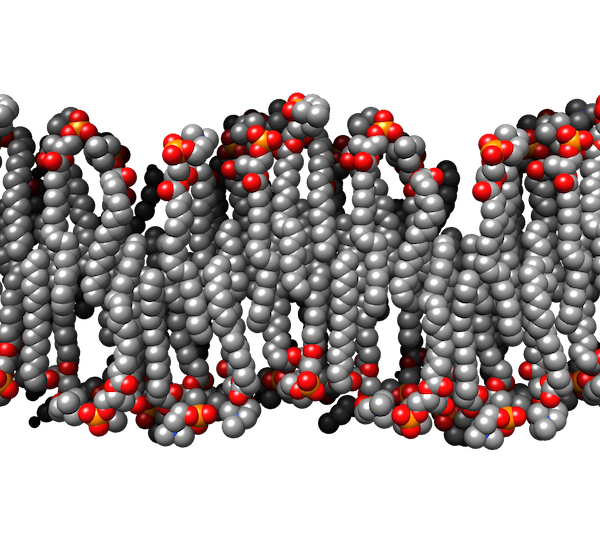

# Envelope
> “It is not a simple life to be a single cell, although I have no right to say so, having been a single cell so long ago myself that I have no memory at all of that stage of my life.”
- Lewis Thomas [@thomas1990]

## Membrane
The fundamental unit of life is the cell– a contained self-replicating assembly. For many species, including all bacteria and archaea, the organism consists of a single cell. And for nearly all species, no matter how many cells an organism eventually contains (probably around 10 trillion in your case), it started life as a single cell. The details vary, but every cell on Earth is the same at heart–a DNA-based replicating machine built from just four macromolecules:  nucleic acids, proteins, lipids and carbohydrates.

Imagine for a moment that you are a structural engineer tasked with building one of these cells. Where would you start?  How about the container? No matter what the first self-replicating molecules were (likely <u>r</u>ibo<u>n</u>ucleic <u>a</u>cid, or RNA), they were not a cell until they acquired a container. You would probably want a flexible container that allowed you to sort certain kinds of molecules from the environment. Evolution agrees. All cells are enclosed by a selectively permeable membrane, made of lipids and proteins [Schematic:Lipid bilayer], that allows them to differentiate their contents from the environment. The selectivity of this membrane is a critical feature for the life of the cell [Schematic:ATP synthase].

Now your cell has a clearly delineated exterior and interior. The interior is called the cytoplasm ("cell mold,” the membrane being the container that shapes the mold). Almost all archaea and many bacteria, like these *Mycoplasma genitalium* cells, are monoderms ("single skin"). This means that their cytoplasm is enclosed by a single membrane. At this resolution, the membrane looks like a single dark line, but remember that it is really a bilayer, as you will be able to see in some later examples.

```{R 2-1, echo=FALSE, screenshot.alt='movie_stills/2_1.png' , fig.cap= 'Mycoplasma genitalium Collected by: Gregory Henderson [10.22002/D1.1350](https://doi.org/10.22002/D1.1350)'}
library(doivideo)
doivideo('10.22002/D1.1350',0)
```

### Lipid bilayer {#Lipid_bilayer}
```{R}

```

Lipids have a hydrophilic head (red/orange here) and hydrophobic tails (grey); in water they spontaneously pack side-by-side and tail-to-tail to shield their tails from unfavorable interactions with water. This results in closed double-layered bags–membranes. One key difference between archaea and bacteria (and with them, eukaryotes) is the kind of lipid in their membranes. Hybrid membranes containing both these lipid types can be made artificially, and it is possible that the last universal common ancestor of all cells on Earth contained both types, with specialization occurring later.

Membranes also contain many proteins. Some have hydrophobic regions that embed them into the lipid bilayer. Other proteins are fused, or tethered, to the lipids. In fact, cells' "lipid" membranes are made up of roughly equal parts lipids and proteins.

### ATP synthase and energy production {#ATP_synthase_and_energy_production}
```{R}
knitr::include_graphics('img/schematics/2_1_2.gif')
```

*PDB: 5T4O*
The chemical properties of lipids make membranes impermeable to ions and large or hydrophilic molecules (but not to water). Cells take advantage of this property to establish an ion gradient across the membrane, using a chain of electron-carrying proteins in the membrane to pump protons out of the cell. Protein complexes in the membrane called ATP synthases (like this one from *Escherichia coli* [@sobti2016]) use the resulting ion potential to generate energy. The machine provides a conduit for protons to flow down their potential, producing a "proton-motive force" that spins the machine's rotor, generating energy that is chemically stored in ATP, the energetic currency of the cell. For this reason, we say that the membrane is “energized.” Holes in the membrane allow the ion gradient to equilibrate, destroying the cell’s means of generating energy, and thus its life.

## Cell Wall
Being able to selectively move things into your cell enables it to do some powerful things. It also poses a structural problem. Remember that water can pass freely through the membrane, which means that increasing the solute concentration inside relative to the environment outside will cause water to rush in as well, introducing a pressure (known as turgor pressure) on the membrane. Lipid bilayers, unfortunately, are unable to withstand much pressure. If your cell lives exclusively in a constant, and fairly high-osmolarity, environment (like our bodies, in the case of the pathogenic *Mycoplasma genitalium* you just saw), it can balance internal and external osmolarity to minimize turgor pressure on its membrane. But most cells experience more variable, and dilute, environments. How could you keep your cell from bursting in such conditions?

You might want to add some rigid scaffolding outside the membrane to buttress it against turgor pressure. Nearly all bacteria do this with a material called peptidoglycan: long stiff polymers of glycan sugars crosslinked by short peptides into a chain-mail-like mesh. The full scaffold of this material surrounding the cell is called its sacculus, or cell wall. In monoderm bacteria like this *Listeria monocytogenes*, the cell wall is significantly thicker than the membrane. It comprises several layers of peptidoglycan, which are indistinguishable at this resolution, so the cell wall appears as a uniformly textured layer [More: Peptidoglycan architecture](#Peptidoglycan_architecture). It remains a mystery how large molecules can pass through this dense layer on their way to and from the cell.

While most bacteria build their walls from peptidoglycan, some use slightly different materials [More: Methanobacterium formicicum](#Methanobacterium_formicicum). Some archaea also have cell walls, also made of a molecule similar to peptidoglycan, but chemically distinct. Most archaea, though, rely on a different structure for support, which you will see in a few pages.

A wall can be a boon to your cell, but it can also prove a liability in certain conditions. For instance, many antibiotics target the cell wall. Some bacteria have developed the ability to jettison their walls in such conditions, taking on a so-called “L-form” (named for the Lister Institute where it was discovered). L-form bacteria give us a fascinating window into how early cells–prior to the evolution of the cell wall–might have looked and behaved.

```{R 2-2, echo=FALSE, screenshot.alt='movie_stills/2_2.png' , fig.cap= 'Listeria monocytogenes Collected by: Ariane Briegel [10.22002/D1.1351](https://doi.org/10.22002/D1.1351)'}
library(doivideo)
doivideo('10.22002/D1.1351',0)
```

### Peptidoglycan architecture{#Peptidoglycan_architecture}
The sacculus is so robust that it persists even after cells are lysed and their other components digested. This sacculus isolated from a *Bacillus subtilis* cell has retained its shape, simply flattening with the release of contents and pressure from inside. The long glycan strands are oriented in hoops running parallel to the short axis of the cylindrical cell and the short peptide crosslinks are more or less aligned with the long axis.

```{R 2-2a, echo=FALSE, screenshot.alt='movie_stills/2_2a.png' , fig.cap= 'Bacillus subtilis Collected by: Morgan Beeby [10.22002/D1.1360](https://doi.org/10.22002/D1.1360)'}
library(doivideo)
doivideo('10.22002/D1.1360',0)
```

### Methanobacterium formicicum{#Methanobacterium_formicicum}
These methane-producing bacteria, found in the rumen of animals like cows, build their walls with a polymer that has a slightly different chemical composition than peptidoglycan, but which forms a similar structure, as you can see.

```{R 2-2b, echo=FALSE, screenshot.alt='movie_stills/2_2b.png' , fig.cap= 'Methanobacterium formicicum Collected by: Elitza Tocheva [10.22002/D1.1361](https://doi.org/10.22002/D1.1361)'}
library(doivideo)
doivideo('10.22002/D1.1361',0)
```

## Outer Membrane
Why stop at one membrane? Eukaryotic cells use internal membranes to form specialized compartments like the nucleus and mitochondria. While bacteria lack such organelles, many create an additional compartment *outside* the cell with a second, outer, membrane. Such bacteria, like the *Cupriavidus necator* cell you see here, are called diderms ("double skin"). The extra compartment between their membranes is known as the periplasm ("mold between"). This antechamber contains a unique subset of proteins, many of which function in escorting things into and out of the main cell.

Compared to the inner membrane, the outer membrane has some unique properties. It is more permeable and not proton-tight (so it cannot be used to generate ATP). It is often asymmetric, with a different composition of lipids and proteins in each of the two leaflets. A few species of bacteria, particularly pathogens, have labile outer membranes (for an example, check out the *Helicobacter pylori* in Chapter 8–RecA). Most, however, firmly anchor their outer membrane to the cell wall [Schematic: Braun's lipoprotein]. Rather than containing many layers of peptidoglycan like in the *Listeria monocytogenes* cell you just saw, the cell wall of diderms is usually composed of a single layer of peptidoglycan mesh [More: Diderm sacculus architecture](#Diderm_sacculus_architecture), which is visible here as a thin line in the periplasm. This minimal sacculus presents a considerable challenge for growth: how can you remodel a single-layered wall that is under pressure? The answer, as we are beginning to figure out, is very carefully [Schematic: Sacculus remodeling].

The difference in thickness of monoderm and diderm cell walls enables a well-known classification system: the Gram stain, which binds peptidoglycan. Gram-positive bacteria, typically monoderm, contain much more peptidoglycan than Gram-negative bacteria, which are typically diderm.

```{R 2-3, echo=FALSE, screenshot.alt='movie_stills/2_3.png' , fig.cap= 'Hydrogenovibrio crunogenus Collected by: Cristina Iancu [10.22002/D1.1352](https://doi.org/10.22002/D1.1352)'}
library(doivideo)
doivideo('10.22002/D1.1352',0)
```

### Braun's lipoprotein {#Brauns_lipoprotein}
```{R}
knitr::include_graphics('img/schematics/2_3_1.gif')
```

*PDB: 1EQ7*
Lipoproteins are hybrid molecules, formed by covalently linked lipid and protein pieces. The lipid allows them to embed into a membrane, tethering the attached protein to function nearby. Braun's lipoprotein, or Lpp [@shu2000], is one of the most abundant molecules in the outer membrane of cells like *Escherichia coli*. The top of the trimeric protein “coiled-coil” contains the lipid tether. The bottom binds the peptidoglycan cell wall, creating a link between the outer membrane and the cell wall (adding up, for a typical *E. coli* cell, to about 100,000 links). These links determine the distance between the two layers.

### Diderm sacculus architecture{#Diderm_sacculus_architecture}
Compare this diderm sacculus purified from *Escherichia coli* to the monoderm sacculus on the last page. Since this one is thinner, we can make out more details, like the glycan strands running around the circumference of the cell. The main difference between the two types of sacculi seems to be whether they have largely a single layer of peptidoglycan (diderm) or many layers (monoderm). So even though the two types of wall look different, their architecture is fundamentally the same. In some circumstances, as you will see in Chapter 8, cells can even switch between the two forms.

```{R 2-3a, echo=FALSE, screenshot.alt='movie_stills/2_3a.png' , fig.cap= 'Escherichia coli Collected by: Lu Gan [10.22002/D1.1362](https://doi.org/10.22002/D1.1362)'}
library(doivideo)
doivideo('10.22002/D1.1362',0)
```

### Sacculus remodeling {#Sacculus_remodeling}
```{R}
knitr::include_graphics('img/schematics/2_3_2.gif')
```

Encasing your cell in a rigid scaffold presents a problem: how can it grow? It is easy to make membranes larger simply by adding more lipids. But to add more peptidoglycan strands, they must be linked into the existing network, which means breaking existing links to accommodate them. To do this, cells use three tools: an enzyme that links glycan sugars into strands, an enzyme that links glycan strands together with peptide bonds, and an enzyme that cuts these peptide links to allow new strands to be linked. Remember, though, that your cell, with its solute-rich interior, has a turgor pressure pushing outward with a force of perhaps 3 atmospheres, equivalent to what we would feel at a depth of 20 meters in the ocean. This is more than enough pressure to lyse an exposed membrane, so the tools must be wielded with care or the cell would burst. We are still figuring out how this works, with help from computer simulations like this one. Here you see a model of an *Escherichia coli* sacculus being enlarged using the three enzyme tools we just described (the colored balls). This simulation was run to test whether just having the tools function in a complex rather than separately might provide enough coordination for smooth, safe growth [@nguyen2015]. (The answer was yes.)

## Vesicles
What else can your cell do with an extra membrane? Since membranes make such excellent containers for molecules, why not get into the shipping business? In the coming chapters (especially Chapter 9), you will see some of the ways that cells interact with each other and their environment. For diderm bacteria, many of these interactions are made possible by outer membrane vesicles ("little bladders")–self-contained pockets budded off the membrane. The vesicles may carry cargo of antibiotics to inhibit competitors' growth, or toxins to lyse neighboring cells. Or enzymes to digest those lysed remains into nutrients that your cell can easily take up as food. Alternatively, they may carry emergency kits, first aid and survival factors for other members of a community biofilm. The appearance of these vesicles can vary as much as their contents [More: Pearled vesicles](#Pearled_vesicles) [More: Tubular vesicles](#Tubular_vesicles). They are usually spherical, though, of a fairly consistent size, and often come off the cell at one or a few sites, forming chains, as you can see in this *Myxococcus xanthus* cell.

Not all diderms produce outer membrane vesicles, and even for those that do, we still do not know exactly how they do it. Maybe it happens spontaneously due to the physics of lipids and proteins in a certain configuration. Or maybe there is a dedicated protein machine in the membrane, blowing bubbles. Vesicles can also bud from the cytoplasmic or (for monoderms) inner membrane into the cytoplasm or periplasm [More: Cytoplasmic vesicles](#Cytoplasmic_vesicles). This seems to be a less regulated process than outer membrane vesicle formation, and we see it in many species when they are stressed by low nutrients or high cell density, suggesting that it is a general phenomenon. Cells shrink in harsh conditions (more on that in Chapter 8), so cytoplasmic or periplasmic vesicles may simply offer a place to put the extra membrane or, more optimistically, to store it until the time comes to grow again. Just as with outer membrane vesicles, the appearance of cytoplasmic vesicles varies widely [More: Cytoplasmic vesicle variety](#Cytoplasmic_vesicle_variety). Archaea also produce membrane vesicles, both extracellular and cytoplasmic [More: Archaeal vesicles](#Archaeal_vesicles). They have been studied less than their bacterial counterparts, but likely serve similar roles in metabolism and community interactions.

```{R 2-4, echo=FALSE, screenshot.alt='movie_stills/2_4.png' , fig.cap= 'Myxococcus xanthus Collected by: Yi-Wei Chang [10.22002/D1.1474](https://doi.org/10.22002/D1.1474)'}
library(doivideo)
doivideo('10.22002/D1.1474',0)
```

### Pearled vesicles{#Pearled_vesicles}
Different species can produce outer membrane vesicles that look very different. The same species can even produce vesicles that look very different. Sometimes they come off the cell as a chain of spheres; sometimes the spheres remain connected, like a string of pearls, as in this *Borrelia burgdorferi* cell. Sometimes vesicles form long tubes instead [More–Tubular vesicles]. Sometimes the same chain can be tubular in one section (usually at the base, connected to the cell), and a string of spheres in another.

```{R 2-4a, echo=FALSE, screenshot.alt='movie_stills/2_4a.png' , fig.cap= 'Borrelia burgdorferi 2 Collected by: Ariane Briegel [10.22002/D1.1363](https://doi.org/10.22002/D1.1363)'}
library(doivideo)
doivideo('10.22002/D1.1363',0)
```

### Tubular vesicles{#Tubular_vesicles}
Here, again from a *Borrelia burgdorferi* cell, you can see extended, tubular outer membrane vesicles.

```{R 2-4b, echo=FALSE, screenshot.alt='movie_stills/2_4b.png' , fig.cap= 'Borrelia burgdorferi Collected by: Ariane Briegel [10.22002/D1.1353](https://doi.org/10.22002/D1.1353)'}
library(doivideo)
doivideo('10.22002/D1.1353',0)
```

### Cytoplasmic vesicles{#Cytoplasmic_vesicles}
Not all vesicles come from the outer membrane. The cytoplasmic or inner membrane can also form vesicles that are released into the cytoplasm, as in this *Myxococcus xanthus* cell, or into the periplasm.

```{R 2-4c, echo=FALSE, screenshot.alt='movie_stills/2_4c.png' , fig.cap= 'Myxococcus xanthus Collected by: Matthew Swulius [10.22002/D1.1364](https://doi.org/10.22002/D1.1364)'}
library(doivideo)
doivideo('10.22002/D1.1364',0)
```

### Cytoplasmic vesicle variety{#Cytoplasmic_vesicle_variety}
Cytoplasmic vesicles exhibit a variety of sizes and shapes. Some are nested, with vesicles inside vesicles. In this *Prosthecobacter debontii* cell, you can see two other morphologies. One is a large, flattened horseshoe-shaped vesicle. Another is a more typical spherical shape, but is decorated with what look like protein complexes.

This cell also has unusual structures on its surface that have yet to be identified.

```{R 2-4d, echo=FALSE, screenshot.alt='movie_stills/2_4d.png' , fig.cap= 'Prosthecobacter debontii Collected by: Martin Pilhofer [10.22002/D1.1365](https://doi.org/10.22002/D1.1365)'}
library(doivideo)
doivideo('10.22002/D1.1365',0)
```

### Archaeal vesicles{#Archaeal_vesicles}
Just like bacteria, archaea also produce both internal and external vesicles, as you can see in this *Halomicrobium mukohataei* cell.

```{R 2-4e, echo=FALSE, screenshot.alt='movie_stills/2_4e.png' , fig.cap= 'Halomicrobium mukohataei Collected by: Ariane Briegel [10.22002/D1.1475](https://doi.org/10.22002/D1.1475)'}
library(doivideo)
doivideo('10.22002/D1.1475',0)
```

## Variation
Evolution is endlessly creative, providing exceptions to nearly every classification rule. We have just described a neat breakdown of bacteria into monoderms (one membrane, thick sacculus, positive Gram stain) and diderms (two membranes, thin sacculus, negative Gram stain). But some cells, like this *Mycobacterium marinum*, defy such easy classification. *Mycobacteria* are diderm, with an inner and an outer membrane, and a cell wall. But they have unique molecules (named mycolic acids in their honor) in the outer membrane. These acids interfere with Gram staining, yielding an intermediate result between positive and negative. And their sacculus consists of three layers of sugars, each with a unique molecular composition. The middle layer is the familiar peptidoglycan.

This cell illustrates another important point: we cannot always see everything that is there. In this case, we cannot see an additional layer outside the outer membrane called the capsule. The capsule, present in many bacteria (mostly diderm, but also some monoderm), is made up of an "<u>e</u>xtracellular <u>p</u>olymeric <u>s</u>ubstance," or EPS: long chains of sugars, sometimes linked to the outer membrane and sometimes free-floating. These sugars help the cell attach to surfaces and offer an extra layer of protection, trapping water to prevent desiccation and making it more difficult for hydrophobic molecules like detergents to get through to disrupt the membrane(s). It also makes it more difficult for viruses to reach the cell, and for eukaryotic predators like macrophages to eat it. The EPS does not interact strongly with electrons, though, so the capsule is usually invisible by electron microscopy.

```{R 2-5, echo=FALSE, screenshot.alt='movie_stills/2_5.png' , fig.cap= 'Mycobacterium marinum Collected by: Elitza Tocheva [10.22002/D1.1354](https://doi.org/10.22002/D1.1354)'}
library(doivideo)
doivideo('10.22002/D1.1354',0)
```

## Surface Layer
How else can you protect your cell from the rigors of a harsh world? What about encasing it in an armored shell a la the armadillo? Many bacteria (both monoderms and diderms) and archaea use modular proteins for this purpose, interlocking Lego-block-like pieces into a shell called the Surface Layer, or S-layer. This must offer a significant evolutionary advantage since up to 15% of the total protein in the cell can be found in the structure. In fact, surface layers play many roles for cells, but one of their main functions for bacteria is as a gatekeeper, preventing large things like viruses from reaching the membrane.

Surface layers are crystalline lattices, and they can be striking in appearance, as on this *Caulobacter crescentus* cell. Amazingly, the lattice is made from (many copies of) a single protein [Schematic: Surface layer architecture]. The pinwheel-like subunits interact laterally, leaving pores large enough for nutrients to pass through, but too small for viruses. The modular nature of the lattice means that units can be popped in as the cell grows, or popped out to allow a cell appendage to poke through. They even accommodate vesicles [More: Nanopods](#Nanopods). Surface layer proteins are often chemically modified to alter their properties; for instance, a sugar may be added to stick the cell to a surface.

```{R 2-6, echo=FALSE, screenshot.alt='movie_stills/2_6.png' , fig.cap= 'Caulobacter crescentus Collected by: Ariane Briegel [10.22002/D1.1355](https://doi.org/10.22002/D1.1355)'}
library(doivideo)
doivideo('10.22002/D1.1355',0)
```

### Surface layer architecture {#Surface_layer_architecture}
```{R}
knitr::include_graphics('img/schematics/2_6_1.gif')
```

*PDB: 5N97*
A single protein forms the surface layer you just saw in *Caulobacter crescentus*. The protein has two domains. The bottom domain anchors it to lipoproteins attached to the outer membrane. The top domain forms the canopy of the S-layer, organizing hierarchically into hexameric rosettes like this that in turn pack into a larger hexameric lattice [@bharat2017]. This lattice is flexible enough to curve around even narrow regions of the cell like the stalk discussed in Chapter 3.

### Nanopods{#Nanopods}
Archaea and bacteria with surface layers produce characteristic outer membrane vesicles: they bud off with the surface layer attached. You will see plenty of examples in the coming pages. *Delftia acidovorans* like this produce so-called nanopods: chains of outer membrane vesicles ensheathed in surface layer.

```{R 2-6a, echo=FALSE, screenshot.alt='movie_stills/2_6a.png' , fig.cap= 'Delftia acidovorans Collected by: Elitza Tocheva [10.22002/D1.1366](https://doi.org/10.22002/D1.1366)'}
library(doivideo)
doivideo('10.22002/D1.1366',0)
```

## Surface Layer Variety
One of the most striking features of the surface layer is how different it can look in different species. For instance, compare this archaeal *Sulfolobus solfataricus* cell to the bacterium on the last page, or to other diderm [More: Methylomicrobium alcaliphilum](#) or monoderm [More: Clostridium thermocellum](#Clostridium_thermocellum) bacteria, or archaea [More: Nitrosopumilis maritimus](#) [More: Methanoregula formicica](#Methanoregula_formicica). All surface layers are crystalline lattices of a single–or in a few cases, two–proteins, but the particular pattern of the lattice depends on the shape of this building block and how it multimerizes into a higher-order structure. The shape of the building block varies considerably; there is almost no sequence homology between S-layer proteins from different species. And shapes come together in different ways, forming repeating units of one, two, three (as on this cell), four, or six blocks.

S-layers are very common in archaea like this *S. solfataricus*. Most archaea lack cell walls, so the surface layer functions as external scaffolding. Remember, too, that nearly all archaea are monoderms, lacking the extra periplasmic compartment that diderms have. Here again the surface layer serves a similar function, enclosing a space around the cell's membrane called the pseudo-periplasmic space. Just as with the bacterial periplasm, this space serves as an antechamber for the cell, restricting access by large molecules. In some cases, the pseudo-periplasmic space also contains specific proteins that function in metabolism.

```{R 2-7, echo=FALSE, screenshot.alt='movie_stills/2_7.png' , fig.cap= 'Sulfolobus solfataricus Collected by: Lu Gan [10.22002/D1.1356](https://doi.org/10.22002/D1.1356)'}
library(doivideo)
doivideo('10.22002/D1.1356',0)
```

### M. alcaliphilum{#M._alcaliphilum}
In *Methylomicrobium alcaliphilum*, V-shaped surface layer proteins come together to form cups that pack into a hexagonal pattern.

```{R 2-7a, echo=FALSE, screenshot.alt='movie_stills/2_7a.png' , fig.cap= 'Methylomicrobium alcaliphilum Collected by: Songye Chen [10.22002/D1.1367](https://doi.org/10.22002/D1.1367)'}
library(doivideo)
doivideo('10.22002/D1.1367',0)
```

### Clostridium thermocellum{#Clostridium_thermocellum}
Not only diderm bacteria have surface layers, as you can see on this monoderm *Clostridium thermocellum* cell. The main difference is that the proteins are anchored to the cell wall, rather than to the outer membrane (or associated lipoproteins).

```{R 2-7b, echo=FALSE, screenshot.alt='movie_stills/2_7b.png' , fig.cap= 'Clostridium thermocellum Collected by: William Nicolas [10.22002/D1.1476](https://doi.org/10.22002/D1.1476)'}
library(doivideo)
doivideo('10.22002/D1.1476',0)
```

### N. maritimus{#N._maritimus}
In *Nitrosopumilis maritimus*, surface layer proteins form hexagonal rosettes that in turn pack into a hexagonal lattice.

```{R 2-7c, echo=FALSE, screenshot.alt='movie_stills/2_7c.png' , fig.cap= 'Nitrosopumilis maritimus Collected by: Rasika Ramdasi [10.22002/D1.1368](https://doi.org/10.22002/D1.1368)'}
library(doivideo)
doivideo('10.22002/D1.1368',0)
```

### Methanoregula formicica{#Methanoregula_formicica}
The surface layer of *Methanoregula formicica* is a hexagonal lattice of small, nearly circular subunits.

```{R 2-7d, echo=FALSE, screenshot.alt='movie_stills/2_7d.png' , fig.cap= 'Methanoregula formicica Collected by: Ariane Briegel [10.22002/D1.1369](https://doi.org/10.22002/D1.1369)'}
library(doivideo)
doivideo('10.22002/D1.1369',0)
```

## Sheath
Why stop at a single layer of protein? For proof that Nature is endlessly inventive, consider this *Methanospirillum hungatei* cell. These archaea encase themselves in a surface layer, as well as an additional protein layer that forms a highly impermeable sheath. The sheath is also very resistant to pressure, which could be important in the cells' line of work. *M. hungatei* were discovered in sewage, where they break down organic waste, producing methane. One theory is that the sheath acts as a pressure regulator; when enough methane builds up inside the cell, the pressure expands the sheath, opening its pores wide enough to allow the methane to dissipate and new metabolic substrates like hydrogen and carbon dioxide to enter.

The rules of architecture remain the same, though. Just as in the bacterial cell wall, sheath polymers are arranged as hoops perpendicular to the long axis of the rod-shaped cell. The ends of the sheath, as you can see, are special, with multiple protein layers stacking into a thick plug. Cells divide within the sheath, and long chains of cells in a continuous sheath are often observed.

```{R 2-8, echo=FALSE, screenshot.alt='movie_stills/2_8.png' , fig.cap= 'Methanospirillum hungatei Collected by: Ariane Briegel [10.22002/D1.1357](https://doi.org/10.22002/D1.1357)'}
library(doivideo)
doivideo('10.22002/D1.1357',0)
```

## DNA
All the layers we just discussed collectively make up the container, or envelope, of a cell. As you have seen, different species use different combinations of these components to form their envelopes; the only constant is the cytoplasmic (or inner, for diderms) membrane.

Now consider what these envelopes contain. In addition to water and small molecules, you have already seen some large protein complexes like motility machines. You have also seen many ribosomes–the protein/RNA complexes responsible for translation. But you might have been surprised *not* to see something else: deoxyribonucleic acid, or DNA. The molecule containing the instructions for the life of the cell is of paramount importance yet often invisible by microscopy. But not always. Thin filaments of DNA, only about 2 nm wide, blend in with the dense cytoplasm of the cell. When a cell lyses, though, its cytoplasm diffuses into the environment and the DNA filaments stand out against the now-much-reduced background. You can get an idea of the sheer abundance of DNA inside a cell from this *Haloarcula argentinensis* whose envelope has ruptured and contents are spilling out.
```{R 2-9, echo=FALSE, screenshot.alt='movie_stills/2_9.png' , fig.cap= 'Haloarcula argentinensis Collected by: Ariane Briegel [10.22002/D1.1358](https://doi.org/10.22002/D1.1358)'}
library(doivideo)
doivideo('10.22002/D1.1358',0)
```

## Nucleoid
Cells contain enormous amounts of DNA. The single, circular chromosome of this *Bdellovibrio bacteriovorus* cell contains 3,782,950 individual nucleotide pairs, which means that if the circle were cut and laid out as a long piece, it would be about *one thousand times* longer than the cell itself. To fit and function inside the cell, the chromosome has to be extraordinarily organized and packed, a feat we still do not understand. Some of this packing is evident in nearly every cell: the center of the cell tends to have very few large macromolecular complexes like ribosomes, because they are excluded by the densely-packed chromosome(s). Look for these ribosome-excluding zones in the rest of the book; they indicate the location of the bulk of the cell's DNA. Since this region is not enclosed by an internal membrane, it is not called a nucleus (the "karyon" that defines eukaryotes). Instead, we use the term nucleoid to describe the cytoplasmic region where most of the DNA is concentrated.

At times, the nucleoid becomes easier to see. Imagine that your cell wanted to decrease its gene expression (we will discuss why in Chapters 8 and 9). One approach is simply to pack the chromosome so tightly that the transcriptional machinery cannot access the genes. This cell is doing just that, condensing its nucleoid into a dense twisted braid we can easily visualize.

```{R 2-10, echo=FALSE, screenshot.alt='movie_stills/2_10.png' , fig.cap= 'Bdellovibrio bacteriovorus Collected by: Yi-Wei Chang [10.22002/D1.1359](https://doi.org/10.22002/D1.1359)'}
library(doivideo)
doivideo('10.22002/D1.1359',0)
```

## Further Reading

[@errington2013]

[@ptacin2013]

[@sleytr1999]

[@strahl2017]
