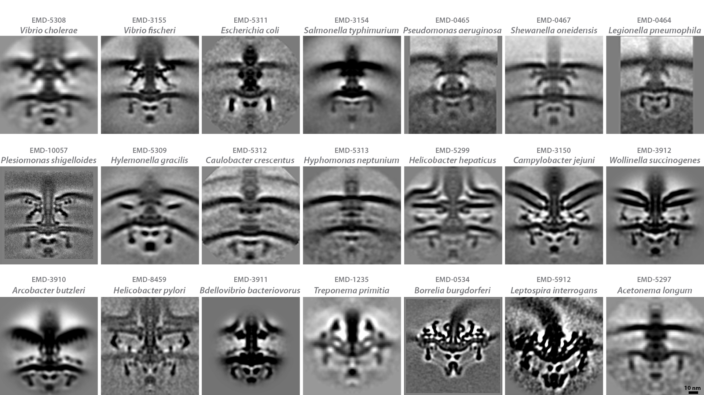

# Motility
> “internal combustion engines do no better.”
- Howard Berg [@berg1988]

## Flagellum
Location, location, location. So far, we have focused on how your cell can take the best advantage of its spot in the world. But why not find a better spot? Some cells live stationary lives, attached to a surface or embedded in a biofilm. Many, though, are explorers, using an impressive variety of techniques to move through their environments, finding advantages in places with more food or fewer competitors. In this chapter, we explore how you might make your cell a mobile home.

Most bacteria and archaea live in liquid, so motility means swimming. When you are the size of a cell, though, the backstroke does not get you very far. A rough measure called the Reynolds number describes the relative influence of inertia and viscosity on liquid flow, and this parameter scales with an organism’s size. In the low-Reynolds number world of microbes, inertia is virtually nonexistent. When a rod-shaped bacterium stops swimming, it gets to coast only about the diameter of a hydrogen atom (~1 Å) before stopping. In this molasses-like environment, rotary propellers work much better than paddles.

Nearly all bacteria that swim use the same propeller: a rotary motor embedded in their envelope that spins a long helical fiber called a flagellum [Schematic: Flagellum structure]. A universal joint called the hook connects the filament to the motor, translating the rotation. Flagella, like the one on this *Campylobacter jejuni*, are typically many times longer than the cell and take the form of a three-dimensional wave. The filament is highly dynamic, as you would expect, and throughout this book, you will see examples caught in various conformations: straight, curved, or in a typical loose helical waveform like this.

(ref:6-1) Campylobacter jejuni Collected by: [Morgan Beeby](#morgan_beeby) Movie DOI: [10.22002/D1.1525](https://doi.org/10.22002/D1.1525)

```{R 6-1, echo=FALSE, screenshot.alt='movie_stills/6_1.jpg' , fig.cap= '(ref:6-1)'}
library(doivideo)
doivideo('10.22002/D1.1525',0)
```

### Flagellum structure {#Flagellum_structure}
```{R}
knitr::include_graphics('img/schematics/6_1_1.gif')
```

*PDB: 5WJT*
The helical filament of the flagellum is made up of many copies of one or a few flagellin proteins. Each flagellin monomer has a soluble head domain and a hydrophobic alpha-helical tail that bundles together with the tails of other monomers to form a hollow tube. The tube comprises 11 twisting protofilaments, as you can see in this section of a flagellum from *Bacillus subtilis* [@wang2017].

## Flagellar Motor
The motor that spins the flagellum is a complicated molecular machine made of many copies of dozens of different proteins, spanning the cell envelope with components in the cytoplasm, the periplasm (in diderms), and outside the cell, as you can see in this *Bdellovibrio bacteriovorus*. To get a closer look, we can average the individual motors from  many cells [More: Flagellar motor structure](#Flagellar_motor_structure). Broadly, the motor consists of a stationary part (the “stators”) that anchors the machine in the cell and a rotating part (the “rotor”) that spins the filament. The torque for spinning the flagellum comes from small movements in the stators that kick the rotor in a circle. The energy for these movements comes from the ion potential across the cell membrane that we discussed in Chapter 2; the stators provide a conduit for protons (in most species) or sodium ions (in some marine species) to diffuse down their chemical gradient into the cytoplasm, powering a conformational change in the stators in the process. The energy demands of the machine are high: a single rotation requires about 1,000 protons to flow through the stators, and the motor may spin at more than 6,000 rotations per minute. The fact that cells pay this energetic cost indicates a strong evolutionary selection for motility, or in other words, the powerful advantage your cell can gain by learning to swim.

While the basic plan of the motor is the same in every species that has flagella, there are structural differences that reflect the different environments species encounter [Schematic: Flagellar motor diversity].

(ref:6-2) Bdellovibrio bacteriovorus Collected by: [Yi-Wei Chang](#yi-wei_chang) Movie DOI: [10.22002/D1.1526](https://doi.org/10.22002/D1.1526)

```{R 6-2, echo=FALSE, screenshot.alt='movie_stills/6_2.jpg' , fig.cap= '(ref:6-2)'}
library(doivideo)
doivideo('10.22002/D1.1526',0)
```

### Flagellar motor structure{#Flagellar_motor_structure}
This is an average of the flagellar motors from more than one thousand *Bdellovibrio bacteriovorus* cells. Working upward from the base, the major parts of the rotor are the C-ring (for <u>C</u>ytoplasmic), the MS-ring (for <u>M</u>embrane and <u>S</u>upramembrane), the rod, the hook, and finally the filament. They are surrounded by stationary parts: the stator ring (which is dynamic, so we cannot resolve the stators as they cross the inner membrane and connect to the C-ring) and a series of bushings that allow rotation within the cell wall (the <u>P</u>eriplasmic or P-ring) and outer membrane (<u>L</u>ipopolysaccharide or L-ring). Additional cytoplasmic components form the export apparatus, which is involved in assembly (discussed on the next page).

(ref:6-2a) Bdellovibrio bacteriovorus Collected by: [Yi-Wei Chang](#yi-wei_chang) Movie DOI: [10.22002/D1.1537](https://doi.org/10.22002/D1.1537)

```{R 6-2a, echo=FALSE, screenshot.alt='movie_stills/6_2a.jpg' , fig.cap= '(ref:6-2a)'}
library(doivideo)
doivideo('10.22002/D1.1537',0)
```

### Flagellar motor diversity {#Flagellar_motor_diversity}
```{R}

```

As you can see in these averages of flagellar motors from different species [@murphy2006] [@chen2011] [@zhao2014] [@beeby2016] [@qin2017] [@chaban2018] [@kaplan2019] [@ferreira2019] [@chang2019], bacteria have evolved structural adaptations of their motors to better suit their environments. For instance, if your cell is a pathogen colonizing an animal’s intestinal tract (like *Campylobacter jejuni*), it will be swimming in more viscous conditions and may therefore have evolved a wider stator ring to generate more torque, along with reinforced anchors in the cell wall and outer membrane to withstand that added torque.

## Flagellar Assembly
Operating the flagellar motor is impressive, but so is building it in the first place. Remember that the envelope of bacterial cells is a complicated multilayered barrier. The flagellar motor has about two dozen unique components, each present in many copies, embedded in every layer of the cell envelope. How can your cell get all hundred or more components (tens of thousands if you count the components of the filament) where they need to go? Making the feat even more impressive, the machine builds itself, assembling from the inside out. First the components associated with the inner membrane come together, forming an “export apparatus” which pumps subsequent components across the membrane to assemble in the periplasm and outer membrane (if the cell is a diderm). The energy for this process comes from an ATPase at the base of the machine. You can see a late stage in this assembly process in this *Hylemonella gracilis* cell. The final piece to be assembled (still missing here) is the flagellar filament, which continues the pattern of outward assembly; flagellin monomers travel through the hollow tube to take their places at the tip. Flagellar motors can also disassemble, for instance when the filament is broken [More: Flagellar motor disassembly](#Flagellar_motor_disassembly), and cells may make many new flagella throughout their lifetime.

So the flagellar motor is not just a machine for motility; it is also a machine to secrete molecules outside the cell. Bacteria and archaea contain many such “secretion systems,” each specialized to transport specific macromolecules (e.g. DNA or a protein toxin) across cell envelopes–both their own and sometimes others. Secretion systems are classified by evolutionary relatedness; there are currently ~10 types recognized in bacteria, some of which are also present in archaea. The flagellar motor is an example of a Type III Secretion System. You will see another member of this family in Chapter 9, and examples of many other types in the rest of the book, starting in just a few pages.

(ref:6-3) Hylemonella gracilis Collected by: [Yi-Wei Chang](#yi-wei_chang) Movie DOI: [10.22002/D1.1527](https://doi.org/10.22002/D1.1527)

```{R 6-3, echo=FALSE, screenshot.alt='movie_stills/6_3.jpg' , fig.cap= '(ref:6-3)'}
library(doivideo)
doivideo('10.22002/D1.1527',0)
```

### Flagellar motor disassembly{#Flagellar_motor_disassembly}
When flagella break (or in some species, like *Caulobacter crescentus*, are ejected so the cell can attach to a surface), the motor is disassembled, usually beginning with the export apparatus. Not everything is dismantled, though; the P- and L-rings remain in place in the cell wall and outer membrane, respectively, as you can see in this *Pseudomonas aeruginosa* cell. We do not know if the cell has a reason for leaving them there, but one possibility is that they may function as a plug for the outer membrane when the hook is no longer present.

(ref:6-3a) Pseudomonas aeruginosa Collected by: [Ariane Briegel](#ariane_briegel) Movie DOI: [10.22002/D1.1538](https://doi.org/10.22002/D1.1538)

```{R 6-3a, echo=FALSE, screenshot.alt='movie_stills/6_3a.jpg' , fig.cap= '(ref:6-3a)'}
library(doivideo)
doivideo('10.22002/D1.1538',0)
```

## Flagella Patterns
Once assembled, flagella can work in different ways. The motor is bidirectional, and can rotate either clockwise or counterclockwise. Depending on the number and location of flagella on the cell (and the cell’s shape), this can push the cell, pull it, or give rise to even more complicated swimming behavior. Some bacterial species, like the *Bdellovibrio bacteriovorus* you just saw, are monotrichous (“single haired”), with one flagellum located at one pole to push/pull the cell. Other species, like the *Campylobacter jejuni* here, have bipolar flagella–one at each end. Still others are lophotrichous (“crest-haired”), with a clump of flagella [More: Lophotrichous bacteria](#Lophotrichous_bacteria).

(ref:6-4) Campylobacter jejuni Collected by: [Morgan Beeby](#morgan_beeby) Movie DOI: [10.22002/D1.1528](https://doi.org/10.22002/D1.1528)

```{R 6-4, echo=FALSE, screenshot.alt='movie_stills/6_4.jpg' , fig.cap= '(ref:6-4)'}
library(doivideo)
doivideo('10.22002/D1.1528',0)
```

### Lophotrichous bacteria{#Lophotrichous_bacteria}
Many lophotrichous species, like the *Hylemonella gracilis* you saw in Chapter 3–Length or this *Helicobacter pylori*, have a tuft of flagella at their cell pole. In some species, though, the tuft is located elsewhere; for example, a clump of flagella on the concave side of banana-shaped *Selenomonas artemidis* pushes the cells sideways in a seesawing swimming pattern.

(ref:6-4a) Helicobacter pylori Collected by: [Yi-Wei Chang](#yi-wei_chang) Movie DOI: [10.22002/D1.1539](https://doi.org/10.22002/D1.1539)

```{R 6-4a, echo=FALSE, screenshot.alt='movie_stills/6_4a.jpg' , fig.cap= '(ref:6-4a)'}
library(doivideo)
doivideo('10.22002/D1.1539',0)
```

## Flagella Patterns (cont’d.)
Still other species are peritrichous (“hair around”), with multiple flagella distributed randomly around the cell, as you can see on this *Pseudomonas flexibilis*. The number of flagella varies between different species, from relatively few here to considerably more [More: Proteus mirabilis flagella](#Proteus_mirabilis_flagella). The well-known model system *Escherichia coli* is also peritrichously flagellated. In this arrangement, when the flagellar motors are all rotating one direction (counter-clockwise), the flagella form a whip-like bundle that propels the cell to “run” in a straight line. When one or more motors switch to clockwise rotation, the flagella dissociate from the bundle and “tumble” the cell to face a new direction. In the next chapter, you will see how cells use this behavior to seek out favorable spots.

(ref:6-5) Pseudomonas flexibilis Collected by: [Morgan Beeby](#morgan_beeby) Movie DOI: [10.22002/D1.1529](https://doi.org/10.22002/D1.1529)

```{R 6-5, echo=FALSE, screenshot.alt='movie_stills/6_5.jpg' , fig.cap= '(ref:6-5)'}
library(doivideo)
doivideo('10.22002/D1.1529',0)
```

### Proteus mirabilis flagella{#Proteus_mirabilis_flagella}
*Proteus mirabilis* adapt their motility machinery to their environment. In liquid, the short rod-shaped cells swim with the help of a handful of flagella distributed peritrichously around their cell body. When they encounter a solid surface, the cells elongate and build many more flagella, as you can see on this cell. Instead of swimming, they now use their flagella to propel themselves in groups across the surface, a motility mode known as “swarming.” This is an example of a differentiated lifecycle, which will come up again in Chapter 8.

(ref:6-5a) Proteus mirabilis Collected by: [Qing Yao](#qing_yao) Movie DOI: [10.22002/D1.1540](https://doi.org/10.22002/D1.1540)

```{R 6-5a, echo=FALSE, screenshot.alt='movie_stills/6_5a.jpg' , fig.cap= '(ref:6-5a)'}
library(doivideo)
doivideo('10.22002/D1.1540',0)
```

## Sheathed Flagella
You may have noticed that some of the flagella in this chapter were enclosed within the outer membrane of the cell. We call these “sheathed” flagella. It is a common adaptation in pathogenic species, like this *Helicobacter hepaticus*. Flagella offer pathogens a great advantage in colonizing their hosts; hosts in turn have learned to use them to identify potential invaders. As a result, the innate immune response of many eukaryotes, from plants to insects to humans, has evolved to recognize the telltale and abundant signal of flagellin proteins in the long filament. If your cell aims to take up residence in such a host, it could therefore benefit from cloaking this strongly antigenic feature.

(ref:6-6) Helicobacter hepaticus Collected by: [Ariane Briegel](#ariane_briegel) Movie DOI: [10.22002/D1.1530](https://doi.org/10.22002/D1.1530)

```{R 6-6, echo=FALSE, screenshot.alt='movie_stills/6_6.jpg' , fig.cap= '(ref:6-6)'}
library(doivideo)
doivideo('10.22002/D1.1530',0)
```

## Periplasmic Flagella
If your cell *is* a pathogen, swimming can be very useful, but so can burrowing, for instance between cells in host tissue. To do this, why not turn your cell into a corkscrew with the equipment at hand? Some cells do just this, wrapping their flagellum around their body to back out of a tight spot, or burrow into one. Other, diderm species like the *Borrelia burgdorferi* here have turned the temporary adaptation into a permanent one: they assemble their flagella *inside* the cell envelope, with the filaments wrapping around between the cell wall and outer membrane. These “periplasmic” flagella are usually multiple, arising from one or both ends of the cell, and pack together, forming a helical ribbon. The helical ribbon helps give these Spirochetes (“spiral haired”) their characteristic shape; mutants that cannot make flagella are simple rods. Some spirochetes also have additional features that may help them move around in animal hosts [More: Treponema primitia](#Treponema_primitia)

(ref:6-7) Borrelia burgdorferi Collected by: [Ariane Briegel](#ariane_briegel) Movie DOI: [10.22002/D1.1531](https://doi.org/10.22002/D1.1531)

```{R 6-7, echo=FALSE, screenshot.alt='movie_stills/6_7.jpg' , fig.cap= '(ref:6-7)'}
library(doivideo)
doivideo('10.22002/D1.1531',0)
```

### Treponema primitia{#Treponema_primitia}
*Treponema primitia* like this are commensal residents of the termite gut, helping break down cellulose. In addition to two periplasmic flagella, the cells have arrays of bowl- and hook-like structures on their surface, the function of which, likely related to motility, remains mysterious.

(ref:6-7a) Treponema primitia Collected by: [Gavin Murphy](#gavin_murphy) Movie DOI: [10.22002/D1.1541](https://doi.org/10.22002/D1.1541)

```{R 6-7a, echo=FALSE, screenshot.alt='movie_stills/6_7a.jpg' , fig.cap= '(ref:6-7a)'}
library(doivideo)
doivideo('10.22002/D1.1541',0)
```

## Archaellum
Archaea swim, too. And as you might expect, they use similar machinery to do so: an envelope-embedded motor that spins a long extracellular filament. Despite the structural similarity, the machinery evolved independently, another indication of the strong advantage conferred by swimming. To reflect this similar-but-not-the-same character, we call the archaeal analogue of the bacterial flagellum the archaellum. Unlike the flagellum, which is a Type III Secretion System, the archaellum is a Type II Secretion System. As you can see on this *Methanoregula formicica* cell, archaella are narrower than flagella [Schematic: Archaellum structure]. The motor is also different, and uses the ATPase at the base not just for assembly, but also to power rotation for swimming. Like flagella, archaellar motors can rotate in either direction, resulting in the filaments pushing or pulling the cell.

(ref:6-8) Methanoregula formicica Collected by: [Ariane Briegel](#ariane_briegel) Movie DOI: [10.22002/D1.1532](https://doi.org/10.22002/D1.1532)

```{R 6-8, echo=FALSE, screenshot.alt='movie_stills/6_8.jpg' , fig.cap= '(ref:6-8)'}
library(doivideo)
doivideo('10.22002/D1.1532',0)
```

### Archaellum structure {#Archaellum_structure}
```{R}
knitr::include_graphics('img/schematics/6_8_1.gif')
```

*PDB: 5TFY*
The overall architecture of the helical archaellum is similar to that of the bacterial flagellum, as you can see in this structure from *Methanospirillum hungatei* [@poweleit2016]. Each protein subunit is smaller, however, resulting in a narrower filament diameter: ~10 nm, compared to ~24 nm for the flagellum. They are also more tightly packed, so there is no central channel.

## Archaella Patterns
Similar to flagella in bacteria, different archaeal species employ different numbers and patterns of archaella. Some species have one, others have many, either distributed peritrichously (all around) as in the *Methanoregula formicica* you just saw, or lophotrichously (clumped) as in this *Thermococcus kodakaraensis*. In *T. kodakaraensis* and related species, an additional structure–a large conical plate–is seen in the cytoplasm, perhaps providing leverage for the multiple motors. The plate has a unique structure [More: Cone structure](#Cone_structure) and may act as an organizing center akin to the polar PopZ structure we discussed in the last chapter [More: Organizing center](#Organizing_center). Note the two peaks on this cone; it may be in the process of replicating in preparation for division.

Not all lophotrichous archaea use a cytoplasmic conical plate [More: Lophotrichous Halobacteria](#Lophotrichous_Halobacteria).

(ref:6-9) Thermococcus kodakaraensis Collected by: [Ariane Briegel](#ariane_briegel) Movie DOI: [10.22002/D1.1533](https://doi.org/10.22002/D1.1533)

```{R 6-9, echo=FALSE, screenshot.alt='movie_stills/6_9.jpg' , fig.cap= '(ref:6-9)'}
library(doivideo)
doivideo('10.22002/D1.1533',0)
```

### Cone structure{#Cone_structure}
The archaellar plate does not come to a point at the tip, but rather is a conical frustum (open at the top), resembling a lampshade. In the center of the tip is a small ring, as you can see in a top view in this lysed, flattened *Thermococcus kodakaraensis* cell. The function of the ring remains unknown; perhaps it helps nucleate the rest of the structure?

(ref:6-9a) Thermococcus kodakaraensis Collected by: [Ariane Briegel](#ariane_briegel) Movie DOI: [10.22002/D1.1542](https://doi.org/10.22002/D1.1542)

```{R 6-9a, echo=FALSE, screenshot.alt='movie_stills/6_9a.jpg' , fig.cap= '(ref:6-9a)'}
library(doivideo)
doivideo('10.22002/D1.1542',0)
```

### Organizing center{#Organizing_center}
As you can see more clearly in this partially-lysed, flattened *Thermococcus kodakaraensis* cell, the conical plate in the cytoplasm is attached to more than just the archaella. It is also associated with chemosensory arrays (discussed in the next chapter) and DNA, as you can see from the ribosome-excluding zone. This structure may therefore perform an analogous function to bacterial organizing proteins such as PopZ, tethering cellular components into a *de facto* pole for the (in this case round) cell.

(ref:6-9b) Thermococcus kodakaraensis Collected by: [Ariane Briegel](#ariane_briegel) Movie DOI: [10.22002/D1.1543](https://doi.org/10.22002/D1.1543)

```{R 6-9b, echo=FALSE, screenshot.alt='movie_stills/6_9b.jpg' , fig.cap= '(ref:6-9b)'}
library(doivideo)
doivideo('10.22002/D1.1543',0)
```

### Lophotrichous Halobacteria{#Lophotrichous_Halobacteria}
While a cytoplasmic plate may help distribute the force of multiple, closely-packed archaella, it is clearly not necessary since other species, like this *Halobacterium salinarum* do not use one.

(ref:6-9c) Halobacterium salinarum Collected by: [Ariane Briegel](#ariane_briegel) Movie DOI: [10.22002/D1.1544](https://doi.org/10.22002/D1.1544)

```{R 6-9c, echo=FALSE, screenshot.alt='movie_stills/6_9c.jpg' , fig.cap= '(ref:6-9c)'}
library(doivideo)
doivideo('10.22002/D1.1544',0)
```

## Type IV Pili
If your cell lives on a surface, what is the best way to get around? How about using a grappling hook? Some bacteria, like this *Myxococcus xanthus*, use a Type II Secretion System related to the archaellar motor to pull themselves around their environment. As you can see, the structure looks familiar: a motor embedded in the envelope with a long extracellular filament. In this case the filament is called a pilus (“hair” in Latin). Bacteria and archaea make many kinds of pili (also generically called fimbriae (“fringe”)) and you will see some of their other functions in later chapters. The *M. xanthus* pili, classified as Type IV pili, function not as propellers like flagella or archaella, but rather extend, attach to a surface, and then retract to pull the cell toward the attachment point [Schematic: Type IV pilus structure]. The pilus motors are the strongest known in nature, and can retract pili at up to 1 μm/s; the combined action of multiple pili leads to extremely rapid “twitching” motility of the cell over a surface. The motor structure, or basal body, remains intact even when no pilus is assembled. These rod-shaped cells have many basal bodies at both cell poles; to switch direction, the cell simply disassembles the pili on one end and builds new pili from the machines waiting on the other.

In addition to attaching to a surface, the pili can also attach to other *M. xanthus* cells. This enables the cells to move over surfaces *en masse*. Combined with their practice of eating other bacteria, this property has led them to be compared to packs of wolves hunting down their prey.

(ref:6-10) Myxococcus xanthus Collected by: [Yi-Wei Chang](#yi-wei_chang) Movie DOI: [10.22002/D1.1534](https://doi.org/10.22002/D1.1534)

```{R 6-10, echo=FALSE, screenshot.alt='movie_stills/6_10.jpg' , fig.cap= '(ref:6-10)'}
library(doivideo)
doivideo('10.22002/D1.1534',0)
```

### Type IV pilus structure {#Type_IV_pilus_structure}
```{R}
knitr::include_graphics('img/schematics/6_10_1.gif')
```

A series of rings anchor the Type IV Pilus basal body in the cell envelope. This rigid structure provides leverage for an ATPase at the base to rotate an adaptor in the inner membrane. We think that when it spins in one direction, the adaptor scoops pilin monomers diffusing in the inner membrane into the assembling pilus [@chang2016]. Once the pilus has reached its target, attachment is sensed by the basal body (we do not yet know how). As a result, the assembly ATPase dissociates and a second, homologous ATPase takes its place. This disassembly ATPase spins the adaptor in the opposite direction, escorting pilin monomers back into the inner membrane, ready to join the next growing pilus.

## Type IX Secretion System
Other bacteria use different machinery to move over surfaces. *Flavobacterium johnsoniae* like this cell use a Type IX Secretion System to secrete adhesive filaments. These filaments move on a helical track around the cell, and thereby the cell moves forward on a surface. The power for this gliding movement is thought to come from rotary motors anchored in the cell wall that propel the adhesins along their track in a rack-and-pinion fashion, but we still do not understand the mechanism in detail.

(ref:6-11) Flavobacterium johnsoniae Collected by: [Gregory Henderson](#gregory_henderson) Movie DOI: [10.22002/D1.1535](https://doi.org/10.22002/D1.1535)

```{R 6-11, echo=FALSE, screenshot.alt='movie_stills/6_11.jpg' , fig.cap= '(ref:6-11)'}
library(doivideo)
doivideo('10.22002/D1.1535',0)
```

## Terminal Organelle
Another, familiar, way to get across a surface is to walk. For this to work, though, you need to be able to change the conformation of your body. This is possible if your cell lacks a cell wall or surface layer, like this *Mycoplasma pneumoniae*. Like the *Mycoplasma genitalium* you saw in Chapter 2–Membrane, these cells are intracellular pathogens, so they do not need to buttress their membrane against differences in osmolarity. As a result, they are soft and flexible. This may allow them to use a leg-like internal structure called a terminal organelle to crawl, or more elegantly “glide,” across a surface. The exact mechanism is still unclear, but one possibility is that a hinge-like conformational change in the terminal organelle extends and contracts the back of the cell with respect to the front, similar to the movement of an inchworm (but less exaggerated). Combined with adhesion proteins on the cell surface, this might propel the cell forward.

The skeleton-like terminal organelle gives these cells their characteristic flask shape. In combination with their minimal cell envelope, it can also give rise to an unusual method of cell division. In some species (or genetically engineered strains) that lack the division protein FtsZ, *Mycoplasma* cells still manage to divide. They replicate their terminal organelle normally, as you can see this cell has done, and then the two copies simply walk away from each other, stretching the mother cell between them until the membrane spontaneously separates to produce two daughters.

Keep in mind that these are simply *some* of the ways we know bacteria and archaea get around, and we continue to discover new ones.

(ref:6-12) Mycoplasma pneumoniae Collected by: [Gregory Henderson](#gregory_henderson) Movie DOI: [10.22002/D1.1536](https://doi.org/10.22002/D1.1536)

```{R 6-12, echo=FALSE, screenshot.alt='movie_stills/6_12.jpg' , fig.cap= '(ref:6-12)'}
library(doivideo)
doivideo('10.22002/D1.1536',0)
```

## Further Reading

Albers and Jarrell (2018). *The archaellum: An update on the unique archaeal motility structure*.[@albers2018]

Berg (2003). *The rotary motor of bacterial flagella*.[@berg2003]

Jarrell and McBride (2008). *The surprisingly diverse ways that prokaryotes move*.[@jarrell2008]

Muñoz-Dorado et al. (2016). *Myxobacteria: Moving, killing, feeding, and surviving together*.[@munoz-dorado2016]

Shrivastava and Berg (2015). *Towards a model for Flavobacterium gliding*.[@shrivastava2015]
