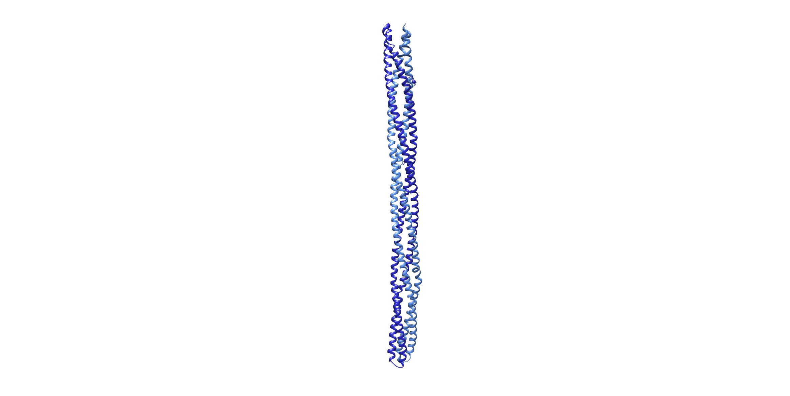

# Navigation
> “*E. coli* forgets where it is going in about 10 seconds.”
- Howard Berg [@berg1988]

## Chemotaxis
Now that your cell can move, it needs to figure out which way to go.  Perhaps it should take a sniff. **Chemosensory systems** are ancient (they were already present in the common ancestor of bacteria and archaea) and widespread, reflecting their great utility. Chemosensory systems are two-component signaling systems. The first component is a receptor that binds a specific chemical, such as a sugar or amino acid. The binding results in a conformational change that propagates down the long receptor [Schematic: Chemoreceptor structure](#Chemoreceptor_structure), turning off a kinase bound at the other end that controls the state of the second component: a response regulator. These response regulator proteins then carry the signal elsewhere in the cell by diffusion.

For **chemotaxis** (“taxis,” or ordered movement, in response to chemicals) the signal is carried to the cell’s motility machinery, the flagellar motor or type IV pili. Phosphorylated response regulators bind the flagellar motor, switching the direction of rotation. This produces different results depending on the pattern of flagella on the cell. If there is a single flagellum, as on this *Shewanella oneidensis* cell, it switches the flagellum between pushing and pulling the cell body, reorienting the cell in the process. In peritrichously-flagellated cells like *Escherichia coli*, it brings the flagella into and out of a bundle. Remember that bundled flagella drive the cell forward in straight “runs” and dissociated flagella “tumble” the cell to try a new direction. Constant feedback from the chemosensory system switches the balance of phosphorylated/unphosphorylated response regulators and therefore keeps the cell heading in the general direction of an attractant chemical cue, or away from a repellant.

Chemosensory systems form arrays containing many copies of the proteins. As in this *S. oneidensis* cell, arrays are usually located near the flagella they control, with the tips of the chemoreceptors sticking through the membrane into the periplasm or extracellular space where they can detect signals from the environment. At the other end of the array, the associated kinases interact with the response regulators. These kinases, along with an additional structural protein that helps organize the array, form a layer that we see as a dense line in the cytoplasm.

(ref:7-1) [Shewanella oneidensis](#tree) Collected by: [Mohammed Kaplan](#mohammed_kaplan) Movie DOI: [10.22002/D1.1545](https://doi.org/10.22002/D1.1545)

```{R 7-1, echo=FALSE, screenshot.alt='movie_stills/7_1.png' , fig.cap= '(ref:7-1)'}
if(offline==TRUE){
library(embedvideo)
embedvideo('videos/7_1_Soneidensis_480p.mp4')
} else {
library(doivideo)
doivideo('10.22002/D1.1545',0,'movie_stills/7_1.png')}
```

### Schematic: Chemoreceptor structure {-#Chemoreceptor_structure}
```{R}

```

[*PDB: 2CH7*](http://rcsb.org/structure/2CH7)
**Chemoreceptors** take the form of long rods. A single protein zips back along itself, and then joins together with a second copy, forming a rigid bundle of four intertwining helices (two from each member of the dimer), as you can see in this dimer of receptors from *Thermotoga maritima* [@park2006]. Only the cytoplasmic portion is shown here; in the cell, the receptors would also have a membrane-embedded anchor at the top and, beyond that, a small domain in the periplasm to bind the chemical of interest. Once a chemical binds, the signal is transmitted down the length of the receptor to a kinase waiting at the distal tip.

## Chemosensory Arrays
**Chemosensory arrays** are highly ordered, as you can best see from a bird’s-eye view, as in this lysed *Salmonella typhimurium* cell. Chemoreceptors come together as dimers, which in turn organize into trimers, which are further packed into the extensive hexagonal honeycombed array you see here. The hexagonal arrangement comes from the baseplate, where the kinases and coupling proteins bind into an ordered array [Schematic: Chemosensory array architecture](#Chemosensory_array_architecture). In what should be a familiar theme by now, organization provides a great benefit. Bacteria and archaea have a tremendous sense of smell, responding to as few as one or two molecules of an attractant, or many more. In fact, the range of chemical concentrations they can sense extends over 5 orders of magnitude. But how can a single receptor transmit a signal efficiently? Perhaps it should share the message with its neighbors. The interlocking network of chemoreceptors enables just this kind of amplification; a target binding to one receptor may translate into activation of 36 adjacent receptors, enormously boosting the gain of the signal.

(ref:7-2) [Salmonella typhimurium](#tree) Collected by: [Morgan Beeby](#morgan_beeby) Movie DOI: [10.22002/D1.1546](https://doi.org/10.22002/D1.1546)

```{R 7-2, echo=FALSE, screenshot.alt='movie_stills/7_2.png' , fig.cap= '(ref:7-2)'}
if(offline==TRUE){
library(embedvideo)
embedvideo('videos/7_2_Styphimurium_480p.mp4')
} else {
library(doivideo)
doivideo('10.22002/D1.1546',0,'movie_stills/7_2.png')}
```

### Schematic: Chemosensory array architecture {-#Chemosensory_array_architecture}
```{R}
knitr::include_graphics('img/schematics/7_2_1.gif')
```

[*PDB: 6S1K*](http://rcsb.org/structure/6S1K)
Here you see two of the basic units of a chemosensory array from *Escherichia coli* [@cassidy2020]. Each unit consists of a trimer of chemoreceptor dimers (a section of which is shown in blue), a kinase (in orange), and a coupling protein (in green). In the cell, these two units would further associate with four more into a rosette of six units, then with other rosettes, forming the extensive hexagonal array. Also keep in mind that these are just the stable components; additional proteins (including the response regulators) interact transiently with the receptors and kinases.

## Chemosensory Array Conservation
The hexagonal array structure of chemosensory systems is invariant across species, and even across domains. As you can see in this *Methanospirillum hungatei* cell, the arrays have the same architecture in archaea as in bacteria, with 12 nm center-to-center spacing between the hexagons. This strong conservation indicates the importance of chemotaxis for cells’ fitness, and suggests that evolution had already honed it to a relatively optimal form in the common ancestor of all these cells.

(ref:7-3) [Methanospirillum hungatei](#tree) Collected by: [Ariane Briegel](#ariane_briegel) Movie DOI: [10.22002/D1.1547](https://doi.org/10.22002/D1.1547)

```{R 7-3, echo=FALSE, screenshot.alt='movie_stills/7_3.png' , fig.cap= '(ref:7-3)'}
if(offline==TRUE){
library(embedvideo)
embedvideo('videos/7_3_Mhungatei_480p.mp4')
} else {
library(doivideo)
doivideo('10.22002/D1.1547',0,'movie_stills/7_3.png')}
```

## Chemoreceptor Variety
While there is only one architectural style for chemosensory systems, there are many different building materials. Each chemoreceptor senses one, or perhaps two related, types of chemicals. This means that if your cell wants to sense multiple chemicals in its environment, it needs a matching assortment of chemoreceptors. This can quickly get complicated. Some signals need to go to the flagella, some to the pili, and others to the transcriptional machinery to turn on or off genes. How can you keep the wires from getting crossed? The simplest approach is just to separate them, and that seems to be exactly what cells do. Chemoreceptors that signal to different systems have different lengths, which sorts them into separate arrays in the cell, as you can see in this *Vibrio cholerae*. The shorter arrays signal to the flagellar motor, and the longer array signals to a different target we have not yet identified. Even when multiple chemosensory systems signal to the same target, arrays that respond to different environmental cues are kept separate by length differences in the receptors [More: Azospirillum brasilense aerotaxis](#Azospirillum_brasilense_aerotaxis).

(ref:7-4) [Vibrio cholerae](#tree) Collected by: [Ariane Briegel](#ariane_briegel) Movie DOI: [10.22002/D1.1548](https://doi.org/10.22002/D1.1548)

```{R 7-4, echo=FALSE, screenshot.alt='movie_stills/7_4.png' , fig.cap= '(ref:7-4)'}
if(offline==TRUE){
library(embedvideo)
embedvideo('videos/7_4_Vcholerae_480p.mp4')
} else {
library(doivideo)
doivideo('10.22002/D1.1548',0,'movie_stills/7_4.png')}
```

### More: Azospirillum brasilense aerotaxis{-#Azospirillum_brasilense_aerotaxis}
A length difference of as little as 2 nm is enough to separate receptors, like these in *Azospirillum brasilense* that sense oxygen (28 nm array) and sources of energy like malate (30 nm array). Both receptors send signals to the single flagellar motor, promoting runs or direction switches to guide the bacterium through a combination of chemotaxis and **aerotaxis** (ordered movement in an oxygen gradient) to its target: plant roots. *A. brasilense* fixes nitrogen, boosting the growth of plants it colonizes.

(ref:7-4a) [Azospirillum brasilense](#tree) Collected by: [Ariane Briegel](#ariane_briegel) Movie DOI: [10.22002/D1.1551](https://doi.org/10.22002/D1.1551)

```{R 7-4a, echo=FALSE, screenshot.alt='movie_stills/7_4a.png' , fig.cap= '(ref:7-4a)'}
if(offline==TRUE){
library(embedvideo)
embedvideo('videos/7_4a_Abrasilense_480p.mp4')
} else {
library(doivideo)
doivideo('10.22002/D1.1551',0,'movie_stills/7_4a.png')}
```

## Cytoplasmic Chemosensory Arrays
In addition to their extensive repertoire of membrane-embedded chemoreceptors, cells may also have another type. Many species of bacteria and archaea, like this *Methanoregula formicica*, contain **cytoplasmic chemosensory arrays**. The receptors lack membrane insertion patches. Instead, they interact end-to-end with each other at their chemical-sensing tips, zippering into a double-layered sandwich, with a baseplate of kinases and coupling proteins on either side. In some species, the arrays are curved like this; in others, they are straight. What these systems sense remains a mystery. One idea is that they monitor the internal state of the cell (e.g. the levels of various metabolites) to fine-tune signaling responses to meet the current needs of the cell. They are often found along with, and often quite close to, membrane-embedded chemosensory arrays [More: Vibrio cholerae chemosensory arrays](#Vibrio_cholerae_chemosensory_arrays).

(ref:7-5) [Methanoregula formicica](#tree) Collected by: [Ariane Briegel](#ariane_briegel) Movie DOI: [10.22002/D1.1549](https://doi.org/10.22002/D1.1549)

```{R 7-5, echo=FALSE, screenshot.alt='movie_stills/7_5.png' , fig.cap= '(ref:7-5)'}
if(offline==TRUE){
library(embedvideo)
embedvideo('videos/7_5_Mformicica_480p.mp4')
} else {
library(doivideo)
doivideo('10.22002/D1.1549',0,'movie_stills/7_5.png')}
```

### More: Vibrio cholerae chemosensory arrays{-#Vibrio_cholerae_chemosensory_arrays}
This *Vibrio cholerae* cell showcases a full complement of chemosensory systems: an extensive membrane-embedded array (signaling to the flagellar motor) and a cytoplasmic array (signaling to a still-unknown target) . In each case, the basic architecture is identical: hexagonally-arranged trimers of chemoreceptor dimers.

(ref:7-5a) [Vibrio cholerae](#tree) Collected by: [Ariane Briegel](#ariane_briegel) Movie DOI: [10.22002/D1.1552](https://doi.org/10.22002/D1.1552)

```{R 7-5a, echo=FALSE, screenshot.alt='movie_stills/7_5a.png' , fig.cap= '(ref:7-5a)'}
if(offline==TRUE){
library(embedvideo)
embedvideo('videos/7_5a_Vcholerae_480p.mp4')
} else {
library(doivideo)
doivideo('10.22002/D1.1552',0,'movie_stills/7_5a.png')}
```

## Magnetotaxis
Chemotaxis is not the only mode of navigation available to your cell. For a clue to others, think about how we orient ourselves in the world. In addition to our nose sniffing out food, we also use our eyes to sense light. Similarly, some photosynthetic bacteria have evolved **phototaxis** (ordered movement in response to light).

We may also use an external tool to navigate unfamiliar surroundings: a compass. Believe it or not, some bacteria have one, too. Magnetotactic species like this *Magnetospirillum magneticum* have evolved specialized structures called **magnetosomes**. They are pockets of inner membrane filled with crystals of a magnetic iron mineral like magnetite. The cell organizes the magnetosomes into a line using filaments of a cytoskeletal protein called MamK [Schematic: MamK structure](#MamK_structure), which is related to eukaryotic actin. The linear chain of magnetosomes functions like the needle of a compass, aligning the cell in a magnetic field.

Magnetosomes first form with the creation of a pocket of inner membrane, as you can see in this cell. Multiple short chains of magnetosomes may form, which are then organized into a single chain by MamK filaments. As mineralization begins, the pockets enlarge to accommodate the growing crystals, ultimately reaching ~60 nm in diameter. Magnetosome chains are inherited by daughter cells through division. Segregation is relatively easy: the chain spans the division plane so that the inward-growing cell wall simply splits the chain between magnetosomes, delivering half the chain to each daughter.

Much remains mysterious about these structures. For instance, what forms the membrane pockets? An even bigger question is how cells use their compasses. One theory is that magnetosomes guide the aquatic bacteria vertically to the optimal height in the water column for, e.g. a certain oxygen level. However, these species are also found at the magnetic equator, where the Earth’s field is horizontal. Another hypothesis is that magnetic orientation improves the efficiency of navigation by buffering the cell against Brownian motion that would knock it off course.

(ref:7-6) [Magnetospirillum magneticum](#tree) Collected by: [Zhuo Li](#zhuo_li) Movie DOI: [10.22002/D1.1550](https://doi.org/10.22002/D1.1550)

```{R 7-6, echo=FALSE, screenshot.alt='movie_stills/7_6.png' , fig.cap= '(ref:7-6)'}
if(offline==TRUE){
library(embedvideo)
embedvideo('videos/7_6_Mmagneticum_480p.mp4')
} else {
library(doivideo)
doivideo('10.22002/D1.1550',0,'movie_stills/7_6.png')}
```

### Schematic: MamK structure {-#MamK_structure}
```{R}
knitr::include_graphics('img/schematics/7_6_1.gif')
```

[*PDB: 5JYG*](http://rcsb.org/structure/5JYG)
MamK, like its eukaryotic homologue, actin, polymerizes into double-stranded filaments like this one from *Magnetospirillum magneticum* [@bergeron2017]. Unlike eukaryotic actin, though, the two strands are in register, rather than being staggered to pack more tightly.

## Summary {#summary7}

```{R}
knitr::include_graphics('img/summaries/07_Navigation.gif')
```

### Concept Check Questions {-}

• What is the lattice arrangement of chemoreceptors in a sensory array?

• Which proteins make up the baseplate of a chemosensory array?

• What happens to the flagellar motor when a response regulator binds?

• What cytoskeletal element organizes magnetosomes into a chain?

### Further Reading {-}

Berg (1988). *A physicist looks at bacterial chemotaxis* [@berg1988].

Hazelbauer et al. (2008). *Bacterial chemoreceptors: High-performance signaling in networked arrays* [@hazelbauer2008].

Lower and Bazylinski (2013). *The bacterial magnetosome: A unique prokaryotic organelle* [@lower2013].

Schuergers et al. (2016). *Cyanobacteria use micro-optics to sense light direction* [@schuergers2016].
