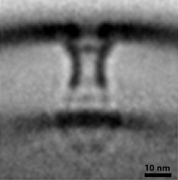

# Interaction
> “We do not have solitary beings. Every creature is, in some sense, connected to and dependent on the rest.”
- Lewis Thomas [@thomas1974]

## Biofilm
So far we have largely ignored a major part of a cell’s environment: other organisms. Your cell is far from alone out there. It shares space and resources with cells of the same species (some its own mothers/sisters/daughters), other species, and even other domains. Think about strategies that could help your cell thrive in such a crowded world. For starters, why can’t we all just get along? Cooperation is common in Nature, often in the form of biofilms–communal groups of microorganisms. Biofilms offer advantages to their members, shielding cells on the interior from harsh conditions or antibiotics, and ensuring nutrients produced by cells’ metabolism or released by their death are readily available to others. Biofilms should be familiar to you; think of the scum on your teeth, or the nearest pond. In fact, the earliest physical evidence we have of life on earth is in the form of stromatolites (“layered rocks”)–meter-scale fossilized biofilms of cyanobacteria (you can see still-growing stromatolites in Shark Bay, Australia).

To attach to a biofilm, cells use strategies we have already discussed, including Tad pili and holdfast. *Agrobacterium tumefaciens* like this one use a holdfast-like polymer called <u>U</u>ni<u>p</u>olar <u>p</u>olysaccharide, or UPP. Some bacteria, including this one, also contribute to the superstructure of the biofilm by secreting cellulose fibers that help form the non-living matrix of the community.

```{R echo=FALSE, screenshot.alt='movie_stills/9_1.png' , fig.cap= 'Agrobacterium tumefaciens Collected by: Elitza Tocheva [10.22002/D1.1571](https://doi.org/10.22002/D1.1571)'}
library(doivideo)
doivideo('10.22002/D1.1571',0)
```

## Biofilm (cont’d.)
Individual cellulose fibers associate into bundles to form a 3D matrix for the cells, as you can see in this thin slice through a *Gluconacetobacter hansenii* biofilm. Not all biofilms contain cellulose, but all have an extracellular matrix, typically made of proteins secreted by the component cells. These proteins have properties that help them aggregate, like the unipolar polysaccharide you just saw. They may also have other properties useful to the community; for instance, *Bacillus subtilis* secretes a hydrophobic protein that forms a resistant coat around the biofilm. Matrices also contain lipids and extracellular DNA, and dead cells contribute material to the superstructure. Keep in mind that the lab-grown biofilm you see here consists of a single species, but in Nature a biofilm often contains multiple species.

```{R echo=FALSE, screenshot.alt='movie_stills/9_2.png' , fig.cap= 'Gluconacetobacter hansenii Collected by: William Nicolas [10.22002/D1.1572](https://doi.org/10.22002/D1.1572)'}
library(doivideo)
doivideo('10.22002/D1.1572',0)
```

## Type II and Type IV Secretion
How else might your cell deal with the crowd? Well, if you can’t join them, maybe you should try to beat (and eat) them. Bacteria have evolved an impressive arsenal of molecular weaponry. In fact, most of the antibiotics we use were invented by bacteria. In many cases, cells simply release these antibiotics to the environment, either directly or in membrane vesicles, which may travel further. For more specific targeting, though, cells employ a varied array of secretion systems. You already saw some of these nanomachines in Chapter 6: a type III secretion system assembles the flagellum and a type II secretion system makes (and unmakes) type IV pili. Other family members have evolved more militaristic functions.

Type II secretion systems (T2SSs) in *Legionella pneumophila* like this pump out effector proteins that enable a complex pathogenic lifecycle. *L. pneumophila* live in several environments: inside amoebae, outside cells (but sometimes with others in biofilms), and inside *our* cells, where they cause the severe pneumonia known as Legionnaires disease. In each environment, the T2SS pumps out proteins that facilitate growth there. For instance, once we inhale *L. pneumophila* with water droplets, they are internalized by macrophages. They then use their T2SSs to secrete proteins that prevent their pockets in the cell (called *Legionella*-containing vacuoles) from being degraded, and suppress our innate immune response. This gives the bacteria time to replicate and establish a persistent colony. The T2SSs also secrete a toxin protein that breaks down lung tissue.

Unlike the secretion systems in Chapter 6, the T2SS does not build an extracellular appendage. Instead, it is thought to work by pumping proteins through the envelope channel using a short piston-like “pseudo-pilus” [Schematic: Legionella T2SS structure], pushing the molecules into the extracellular space. (Keep in mind that for these intracellular pathogens, their extracellular space is the interior of the host cell.)

*L. pneumophila* also use another, unrelated machine, a type IV secretion system (T4SS), to deliver more than 400(!) different kinds of effector proteins into host cells to promote infection. You can see multiple T4SSs primed for action in this cell [Schematic: Legionella T4SS structure]. We do not yet know what they look like during active secretion, so the mechanism remains unclear. In another human pathogen, *Helicobacter pylori*, inactive T4SSs are sometimes seen next to mysterious extracellular tubes, raising the intriguing possibility that the structures are somehow related [More: Helicobacter pylori tubes](#Helicobacter_pylori_tubes).

This *L. pneumophila* cell is not unusual; it is common for pathogenic bacteria to employ multiple types of secretion systems. The bristling arsenal of bacteria is a fearsome thing.

```{R echo=FALSE, screenshot.alt='movie_stills/9_3.png' , fig.cap= 'Legionella pneumophila Collected by: Debnath Ghosal [10.22002/D1.1573](https://doi.org/10.22002/D1.1573)'}
library(doivideo)
doivideo('10.22002/D1.1573',0)
```

### Legionella T2SS structure {#Legionella_T2SS_structure}
```{R}

```

*EMD-20712 EMD-20713*
This average of type II secretion systems from many *Legionella pneumophila* cells shows the overall structure: a channel through the cell envelope, gated near the outer membrane [@ghosal2019]. The pseudo-pilus can be seen in individual T2SSs, extending from the inner membrane to the bottom of the main channel. It gets washed out in the average, though, indicating that it is relatively flexible (i.e. not always in the same position). We still need to figure out exactly how the system works, including whether the pseudo-pilus does act like a piston, and how the gate opens.

### Legionella T4SS structure {#Legionella_T4SS_structure}
```{R}

```

*EMD-0566*
This average of type IV secretion systems from many *Legionella pneumophila* cells shows the overall structure [@ghosal2019a]. We do not yet know how secretion works, but one possibility is that effectors are channeled either straight through the channel from the cytoplasm and/or first into the periplasm and from there into the windowed chamber just inside the outer membrane before finally being escorted out of the cell.

#### Helicobacter pylori {#Helicobacter_pylori_tubes}
This *Helicobacter pylori* cell was cultured together with human gastric epithelial cells, its target for infection. It contains inactive type IV secretion systems, as well as several mysterious tubes. The tubes are formed from the outer membrane, but we do not know what scaffolds them (they have a constant diameter of 37 nm), or what makes the portals along their length. The fact that we sometimes see tubes near primed T4SSs, and the fact that the tubes are missing from mutant cells lacking T4SS components suggests a relationship, but the details are unclear. Much remains mysterious about this structure and its potential role in infection.

```{R echo=FALSE, screenshot.alt='movie_stills/9_3a.png' , fig.cap= 'Helicobacter pylori Collected by: Yi-Wei Chang [10.22002/D1.1582](https://doi.org/10.22002/D1.1582)'}
library(doivideo)
doivideo('10.22002/D1.1582',0)
```

## Type III Secretion
What if your cell wanted to go a step further and deliver toxins directly into its target? Perhaps it needs a needle. One of the most common, and best-studied, pathogenic secretion systems is the type III secretion system (T3SS) that assembles a needle-like toxin delivery system called the injectisome. T3SS injectisomes and flagellar motors are closely related, and the basal machines have similar structures [Schematic: Injectisome structure]. Rather than assembling a long helical filament for motility, though, injectisomes form a shorter needle, which you can see on this *Pseudomonas aeruginosa*. The needle can penetrate a eukaryotic cell, delivering effectors directly to its cytoplasm that block the immune response of the host, and lead to cell lysis.

*It would be wasteful, or detrimental, for your cell to secrete toxins all the time. Pathogens typically have multi-stage lifecycles, often passing through an intermediate host and/or the environment. Pathogenic machinery like secretion systems are typically only produced when conditions signal that the cell has reached its target host (e.g. increased temperature or salt concentration). Until then, the genes encoding the protein components are turned off. This cell is missing a protein (ExsD) that turns off expression of these injectisome components. As a result, it makes injectisomes even outside the host, enabling us to image their structure.*

T3SSs are closely related to type II secretion systems (T2SSs) and share a common element: the channel embedded in the outer membrane, formed by many copies of a protein called a secretin [Schematic: Secretin structure]. As you can see, though, the rest of the machine looks very different.

```{R echo=FALSE, screenshot.alt='movie_stills/9_4.png' , fig.cap= 'Pseudomonas aeruginosa Collected by: Steven Wang [10.22002/D1.1574](https://doi.org/10.22002/D1.1574)'}
library(doivideo)
doivideo('10.22002/D1.1574',0)
```

### Injectisome structure {#Injectisome_structure}
```{R}

```

*EMD-20611*
This average of T3SS injectisomes from many *Shigella flexneri* cells shows the overall structure, including the large “sorting platform” in the cytoplasm which selects proteins for secretion through the channel of the needle [@tachiyama2019].

### Secretin structure {#Secretin_structure}
```{R}
knitr::include_graphics('img/schematics/9_4_2.gif')
```

*PDB: 5WQ8*
Many copies of a Secretin protein come together to form a channel, as in this one from *Vibrio cholerae* [@yan2017a]. In addition to the main channel situated in the outer membrane, different domains of the protein form a series of rings in the periplasm that interact with other components of the system.

## Type V Secretion
Other secretion systems independently evolved similar mechanisms, though using very different structures. Some strains of *Escherichia coli* have an ability, called “<u>C</u>ontact-<u>D</u>ependent <u>I</u>nhibition” or CDI, to inhibit the growth of neighboring diderm bacterial cells. They do this by coopting a pore in the outer membrane of the target cell to introduce a toxin that halts its growth. To safeguard themselves, they make an antitoxin that binds to the toxin and renders it harmless. Such antidote system are common for microbe-produced toxins.

To deliver the toxin to the target, the cells use type V secretion systems (T5SSs) like the ones on this *Escherichia coli*. In contrast to the nanomachines you have been seeing, which contain dozens of unique components, this system is elegantly spare: a channel formed by several copies of one protein (CdiB) in the outer membrane secretes another protein, CdiA. Or rather, it secretes half of it. The first half of CdiA forms the stick you see here, with the second half keeping the toxin domain at the end of the protein sequestered in the periplasm. The tip of the stick contains the domain that recognizes and docks to the receptor pore on the target. When it bumps into a neighboring cell and locks on, the second half of CdiA is secreted, whipping the toxin like a tetherball into the other cell.

*This cell belongs to a strain that is normally incapable of CDI, but has been genetically engineered to produce the T5SS components. Once again, this lets us image the machines more easily; in this case, the CDI-practicing strain has a thicker layer of extracellular proteins, which obscure the needles in a visual haystack.*

```{R echo=FALSE, screenshot.alt='movie_stills/9_5.png' , fig.cap= 'Escherichia coli Collected by: Poorna Subramanian [10.22002/D1.1575](https://doi.org/10.22002/D1.1575)'}
library(doivideo)
doivideo('10.22002/D1.1575',0)
```

## Type VI Secretion
How else could your cell deliver a toxin to a nearby competitor? As usual, Nature has provided another, even more entertaining, option: the poison dart gun. Many diderm bacteria, including *Myxococcus xanthus* like this, use type VI secretion systems (T6SSs) to launch effector proteins into neighboring cells. The effectors vary–from toxins that cause lysis to factors that promote biofilm formation. The target range of the T6SS is similarly broad, including monoderm and diderm bacteria and eukaryotic cells.

This primed T6SS consists of a hollow outer tube, with a narrower dart inside [Schematic: Primed T6SS structure]. The effector protein is loaded at the tip of the dart, where the machine is anchored in the cell envelope. In a few cells, including this one, we see additional filaments flanking the primed T6SS. They are lacking in other cells even of the same species, and their identity and function remain unknown.

```{R echo=FALSE, screenshot.alt='movie_stills/9_6.png' , fig.cap= 'Myxococcus xanthus Collected by: Yi-Wei Chang [10.22002/D1.1576](https://doi.org/10.22002/D1.1576)'}
library(doivideo)
doivideo('10.22002/D1.1576',0)
```

### Primed T6SS structure {#Primed_T6SS_structure}
```{R}
knitr::include_graphics('img/schematics/9_6_1.gif')
```

*PDB: 5URW*
In a primed T6SS, the projectile rod (orange) nests inside the contractile sheath (blue), as in this section of a T6SS from *Myxococcus xanthus* [@chang2017].

## Type VI Secretion (cont’d.)
When the T6SS fires, the helical outer sheath twists into a shorter, wider form, a conformational change that provides the energy to explosively propel the inner dart, cargo-first, out and into its target [Schematic: Fired T6SS structure]. In some species, like this *Vibrio cholerae*, the outer sheath will then be recycled, broken down into building blocks that can be used to rapidly assemble a new machine. Other species build again from scratch, translating new protein building blocks. Warfare is dynamic, with cells rapidly assembling and firing T6SSs. Cells have even been observed to engage in T6SS duels, with an attacked cell building and firing a T6SS back in the direction from which it was hit. Some species even assemble batteries of parallel T6SSs [More: T6SS battery](#T6SS_battery).

These contractile weapons evolved from the “tail” structure viruses called phage use to inject their genetic material into bacteria and archaea (more on that in the next chapter). Some related bacterial weapons are even closer to the phage tail, in that they are released to the environment in a primed state, waiting to bump into a target cell to fire. The target is recognized by filamentous proteins called “tail fibers,” the same identification mechanism used by phage. Other members of this evolutionary family are even stranger, like the <u>M</u>orphogenesis-<u>A</u>ssociated <u>C</u>ontractile structures (MACs) released by a marine bacterium which play a key role in the lifecycle of a (eukaryotic) worm [More: MACs](#MACs) [Schematic: MAC array structure].

```{R echo=FALSE, screenshot.alt='movie_stills/9_7.png' , fig.cap= 'Vibrio cholerae Collected by: Martin Pilhofer [10.22002/D1.1577](https://doi.org/10.22002/D1.1577)'}
library(doivideo)
doivideo('10.22002/D1.1577',0)
```

### Fired T6SS structure {#Fired_T6SS_structure}
```{R}
knitr::include_graphics('img/schematics/9_7_1.gif')
```

*PDB: 5URX*
A conformational change in the T6SS sheath provides the energy to fire the inner rod toward its target. The remaining sheath is shorter and wider than in its primed state, as in this section of a fired T6SS from *Myxococcus xanthus* [@chang2017].

#### Amoebophilus asiaticus {#T6SS_battery}
Some cells assemble a few, scattered type VI secretion systems. Other species, like this *Amoebophilus asiaticus* build ordered arrays of parallel machines. These diderm bacteria live symbiotically inside amoebae. Their T6SS batteries help them colonize their host, perhaps by rupturing the membrane of the host phagosome that encloses them after they are engulfed, releasing them into the host cytoplasm. The number of T6SSs in each array varies, but can reach a few dozen.

```{R echo=FALSE, screenshot.alt='movie_stills/9_7a.png' , fig.cap= 'Amoebophilus asiaticus Collected by: Martin Pilhofer [10.22002/D1.1583](https://doi.org/10.22002/D1.1583)'}
library(doivideo)
doivideo('10.22002/D1.1583',0)
```

#### Pseudoalteromonas luteoviolacea ΔT6SS/bacteriocin {#MACs}
*Pseudoalteromonas luteoviolacea* produce massive arrays of MACs, contractile machines related to pyocins. Cells lyse to release the arrays, like the one you see here, which can contain 100 individual MACs and extend more than 1 µm across. The arrays are highly ordered, with the tail fibers of the MACs networked into a hexagonal array that may help synchronize firing [Schematic: MAC array structure]. MAC arrays serve an important function for larvae of the marine tubeworm *Hydroides elegans*, and likely the larvae of other invertebrates such as sea urchins and corals as well. They signal to the larva that it is the right place to settle down and differentiate into a sessile (surface-attached) adult. The function of MAC arrays for the bacterium is less clear. It may be that the invertebrates benefit the lysed cell’s surviving relatives in the biofilm. Or perhaps the MACs play another, completely unrelated role.

*Note that this MAC array was produced by a cell lacking genes encoding other contractile weaponry (type VI secretion systems and bacteriocins). This was done to make it easier to identify the MACs.*

```{R echo=FALSE, screenshot.alt='movie_stills/9_7b.png' , fig.cap= 'Pseudoalteromonas luteoviolacea Collected by: Martin Pilhofer [10.22002/D1.1584](https://doi.org/10.22002/D1.1584)'}
library(doivideo)
doivideo('10.22002/D1.1584',0)
```

### MAC array structure {#MAC_array_structure}
```{R}
knitr::include_graphics('img/schematics/9_7_2.gif')
```

This digital segmentation of a MAC array shows the overall order of the structure [@shikuma2014]. Outer sheaths are in blue, inner rods in green, tail fibers in orange, and networking fibers in white.

## Type IX Secretion
Instead of going to all the trouble of launching a weapon, why not just turn yourself into the weapon? *Porphyromonas gingivalis* like this one use yet another secretion system, the type IX secretion system (T9SS), to secrete proteins called gingipains to the cell surface, where they are anchored to the outer membrane. Gingipains are peptidases, enzymes that chop up other proteins. In their lifestyle as human oral pathogens, the cells use gingipains to block host immune system signals and digest host biomolecules for food, causing the tissue damage of periodontitis.

In Chapter 6 you saw another T9SS with a very different function, in the gliding motility of *Flavobacterium johnsoniae*. In that case, instead of gingipains, the machine secretes adhesive filaments that are also anchored to the cell surface.

```{R echo=FALSE, screenshot.alt='movie_stills/9_8.png' , fig.cap= 'Porphyromonas gingivalis Collected by: Poorna Subramanian [10.22002/D1.1578](https://doi.org/10.22002/D1.1578)'}
library(doivideo)
doivideo('10.22002/D1.1578',0)
```

## Predation
Some bacteria take the strategy of eating the neighbors to a whole new level. Remember the pack-based hunting of *Myxococcus xanthus* in Chapter 7 (chasing their prey with type IV pilus (T4P)-based twitching motility)? There are also solitary hunters, like *Bdellovibrio bacteriovorus*, which has evolved an elaborate vampiric lifestyle centered around its prey. You have already seen examples of *B. bacteriovorus* cells on the prowl, in what is called “attack phase”. Their bodies are ideally shaped and sized for rapid flagellum-propelled swimming and all superfluous functions like growth and division are halted (remember the highly condensed nucleoid you saw at the end of Chapter 2). When a cell finds a diderm bacterium–*Vibrio cholerae* in this case–it uses its type IV pili to lock on and pull itself closer, as you can see here.

```{R echo=FALSE, screenshot.alt='movie_stills/9_9.png' , fig.cap= 'Bdellovibrio bacteriovorus / Vibrio cholerae Collected by: Yi-Wei Chang [10.22002/D1.1579](https://doi.org/10.22002/D1.1579)'}
library(doivideo)
doivideo('10.22002/D1.1579',0)
```

## Predation (cont’d.)
Once a *Bdellovibrio bacteriovorus* like this one has latched onto its unfortunate host, it opens a portal in the host’s outer membrane, secreting a cocktail of enzymes that alter the host cell wall, causing the cell to round up and enlarge the periplasmic space. The *B. bacteriovorus* quickly slides into the host periplasm through the portal [More: Bdellovibrio bacteriovorus entry](#Bdellovibrio_bacteriovorus_entry) and seals the door behind it. In the process of preparing for entry, the cell dismantles equipment that is no longer necessary, including its chemosensory array and flagellum. As you can see here, the sheathed flagellum dislocates from the motor and is pulled into the periplasm, where the filament is degraded.

*Note that the prey here–the small, round cell–comes from a mutant strain of *Escherichia coli* that has an altered form of the shape-regulating protein MreB, which results in thinner cells. It is also lacking the Min system that positions the division plane at midcell. As a result, division occurs randomly along the length of the cell. The cells that divide near the pole produce “minicells” like this one. Minicells do not contain a genome and are not viable cells, but they can be useful for experiments. In this case, the reduced thickness of the sample improves the quality of cryoET imaging. It also lets us capture intermediates in the *B. bacteriovorus* entry process.*

```{R echo=FALSE, screenshot.alt='movie_stills/9_10.png' , fig.cap= 'Bdellovibrio bacteriovorus / Escherichia coli Collected by: Yi-Wei Chang [10.22002/D1.1580](https://doi.org/10.22002/D1.1580)'}
library(doivideo)
doivideo('10.22002/D1.1580',0)
```

#### Bdellovibrio bacteriovorus + Escherichia coli minicell {#Bdellovibrio_bacteriovorus_entry}
We still do not know exactly how *Bdellovibrio bacteriovorus* enters its host, but the process is extremely rapid. In order to catch a snapshot, we mixed *B. bacteriovorus* with miniaturized prey (see details on the main page). As the *B. bacteriovorus* cell cannot fit inside the prey, it remains stuck half-in and half-out. Note the tight collar of host outer membrane around the invader. How this seal is maintained throughout invasion remains a mystery.

```{R echo=FALSE, screenshot.alt='movie_stills/9_10a.png' , fig.cap= 'Bdellovibrio bacteriovorus / Escherichia coli Collected by: Yi-Wei Chang [10.22002/D1.1585](https://doi.org/10.22002/D1.1585)'}
library(doivideo)
doivideo('10.22002/D1.1585',0)
```

## Predation (cont’d.)
Once inside its host, *Bdellovibrio bacteriovorus* has the leisure to grow and replicate. From its position in the periplasm, the *B. bacteriovorus* cell proceeds to digest the contents of the host cytoplasm, which shrinks down to a dense ball of (presumably undigestible) material. This meal provides the fuel necessary for the *B. bacteriovorus* to grow to several times its original length and undergo a synchronous division to produce several (usually between 2 and 7) daughters. The number of progeny depends on the size of the host cell: two in the case of this relatively small *Vibrio cholerae*. The progeny, reset to the attack phase (note the condensed nucleoids), finally lyse what is left of the host to escape and swim off in search of their next victims.

```{R echo=FALSE, screenshot.alt='movie_stills/9_11.png' , fig.cap= 'Bdellovibrio bacteriovorus / Vibrio cholerae Collected by: Yi-Wei Chang [10.22002/D1.1581](https://doi.org/10.22002/D1.1581)'}
library(doivideo)
doivideo('10.22002/D1.1581',0)
```

## Further Reading

[@christie2019]
[@flemming2016]
[@patz2019]
[@sockett2009]
