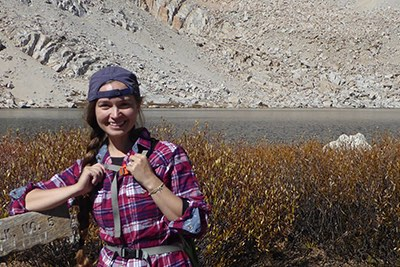

# Scientist Profiles 

Click on a name in the sidebar to learn a little about them.

## Morgan Beeby {-#morgan_beeby}

## Ariane Briegel {-#ariane_briegel}

## Yi-Wei Chang {-#yi-wei_chang}

## Songye Chen {-#songye_chen}

## Georges Chreifi {-#georges_chreifi}

## Prabha Dias {-#prabha_dias}

## Lu Gan {-#lu_gan}

## Debnath Ghosal {-#debnath_ghosal}

## Gregory Henderson {-#gregory_henderson}

## Cristina Iancu {-#cristina_iancu}

## Grant Jensen {-#grant_jensen}

Grant J. Jensen is a Professor of Biology and Biophysics at Caltech. He earned his doctorate in Biophysics from Stanford, working on electron microscopy of RNA polymerase and other protein complexes with Dr. Roger Kornberg. He continued his work in protein electron microscopy as a Damon Runyon-Walter Winchell post-doctoral fellow under the supervision of Dr. Kenneth Downing at the Lawrence Berkeley National Lab. Here his interests expanded to include electron tomography of whole cells. Grant launched his own lab at Caltech in 2002, where his research has focused on three main areas: the ultrastructure of small cells, the structural biology of HIV, and the further development of cryoEM technology. 

```{R}
knitr::include_graphics('img/bios/grant_jensen.jpg')
```

## Mohammed Kaplan {-#mohammed_kaplan}

## Zhuo Li {-#zhuo_li}

## Shrawan Mageswaran {-#shrawan_mageswaran}

## Alasdair McDowall {-#alasdair_mcdowall}

## Lauren Ann Metskas {-#lauren_ann_metskas}

## Gavin Murphy {-#gavin_murphy}

## Lam Nguyen {-#lam_nguyen}

## William Nicolas {-#william_nicolas}

## Catherine Oikonomou {-#catherine_oikonomou}

Catherine M. Oikonomou is a research scientist and science writer at Caltech. She received her doctorate from the Rockefeller University, where she worked with Dr. Frederick Cross on cell cycle control in budding yeast. In 2012, she joined the lab of Dr. Grant Jensen at Caltech, where she has been exploring microbial cell biology through cryo-electron tomography.

```{R}

```

## Martin Pilhofer {-#martin_pilhofer}

## Sahand Pirbadian {-#sahand_pirbadian}

## Rasika Ramdasi {-#rasika_ramdasi}

## Jian Shi {-#jian_shi}

## Poorna Subramanian {-#poorna_subramanian}

## Matthew Swulius {-#matthew_swulius}

## Elitza Tocheva {-#elitza_tocheva}

## Steven Wang {-#steven_wang}

## Elizabeth Wright {-#elizabeth_wright}

## Qing Yao {-#qing_yao}
