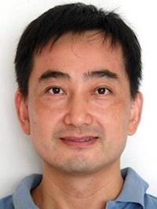

# Scientist Profiles 

Click on a name in the sidebar to learn a little about them.

## Morgan Beeby {-#morgan_beeby}

Morgan Beeby is a group leader at Imperial College London. In London. He earned his PhD with Todd O. Yeates at UCLA where he developed interests in evolution, bioinformatics, and structural biology. Electron cryotomography was the clear next step, prompting him to join Grant’s lab as a postdoc from 2008 to 2012. In 2013 he established his own lab using cryoET as the backbone of an interdisciplinary research program to understand the evolution of molecular machines, with a focus on bacterial flagella.

```{R}
knitr::include_graphics('img/bios/morgan_beeby.jpg')
```

## Ariane Briegel {-#ariane_briegel}

Ariane Briegel is Professor of Ultrastructural Biology at the Leiden University (The Netherlands) and co-director of the Dutch center for electron Nanoscopy (NeCEN). She earned her PhD in the laboratory of Prof. Wolfgang Baumeister at the Max Planck Institute in Martinsried Germany. Here, she learned the power of Electron Tomography to study microbes in three dimensions and at macromolecular resolution. She continued to explore the wonders of bacterial structure and function in the laboratory of Grant Jensen as a postdoc and research scientist. She  has 20 years of experience using cryo-electron microscopy to study bacterial and archaeal ultrastructure. The Briegel laboratory focuses on investigating how microbes sense and respond to their environment using cryoEM methods.

```{R}
knitr::include_graphics('img/bios/ariane_briegel.jpg')
```

## Yi-Wei Chang {-#yi-wei_chang}

Yi-Wei Chang is a structural biology enthusiast and principal investigator at the University of Pennsylvania. Yi-Wei received his Ph.D. degree from National Tsing-Hua University and Academia Sinica in Taiwan, working with Chwan-Deng Hsiao in using X-ray crystallography to study atomic structural details of purified proteins. After being astonished by Grant Jensen’s visiting seminar at Academia Sinica highlighting the power of cryo-electron tomography in resolving macromolecular structures directly in cellular contexts, Yi-Wei set this as his long term research direction and was lucky enough to join the Jensen laboratory at Caltech in 2011 as a postdoctoral scholar. After years of working with the amazing group to master cryo-electron tomography methods and visualize fascinating macromolecular structures in situ, Yi-Wei launched his own laboratory at the University of Pennsylvania Perelman School of Medicine in 2019 to continue exploring the magnificent in-cell structural biology and to nurture the next generation of outstanding scientists.

```{R}
knitr::include_graphics('img/bios/yi-wei_chang.jpg')
```

## Songye Chen {-#songye_chen}

## Georges Chreifi {-#georges_chreifi}

## Prabha Dias {-#prabha_dias}

## Lu Gan {-#lu_gan}

## Debnath Ghosal {-#debnath_ghosal}

Debnath Ghosal is a senior lecturer at University of Melbourne. Debnath received his PhD degree in structural biology from the MRC Laboratory of Molecular Biology (University of Cambridge, Darwin College), where he worked with Dr. Jan Lowe on bacterial cell division. Subsequently, he joined Dr. Grant Jensen's laboratory at Caltech for his postdoctoral training. At Caltech, he investigated the structure and function of bacterial secretion systems using electron cryotomography. Debnath established his own laboratory at University of Melbourne in 2020. His group is working on the structural and molecular biology of large bacterial protein complexes that are important for pathogenesis.

```{R}
knitr::include_graphics('img/bios/debnath_ghosal.jpg')
```

## Gregory Henderson {-#gregory_henderson}

## Cristina Iancu {-#cristina_iancu}

Cristina V. Iancu received her B.S. in Biophysics from the Faculty of Physics of the University of Bucharest, Romania, and her Ph.D. in Biochemistry from Iowa State University, Ames, IA, U.S. Her graduate work in the protein crystallography group of Dr. Richard B. Honzatko involved structural and functional studies of key enzymes in gluconeogenesis and de novo nucleotide synthesis. She joined the cryo-EM lab of Dr. Grant J. Jensen as his first postdoc, where she worked on cryo-ET method development projects and cryo-ET structure determination of protein complexes, isolated carboxysomes, and carboxysome-producing bacteria. Currently, she works on drug discovery targeting carbohydrate transporters with Dr. Jun-yong Choe.

## Grant Jensen {-#grant_jensen}

Grant J. Jensen is a Professor of Biology and Biophysics at Caltech. He earned his doctorate in Biophysics from Stanford, working on electron microscopy of RNA polymerase and other protein complexes with Dr. Roger Kornberg. He continued his work in protein electron microscopy as a Damon Runyon-Walter Winchell post-doctoral fellow under the supervision of Dr. Kenneth Downing at the Lawrence Berkeley National Lab. Here his interests expanded to include electron tomography of whole cells. Grant launched his own lab at Caltech in 2002, where his research has focused on three main areas: the ultrastructure of small cells, the structural biology of HIV, and the further development of cryoEM technology. 

```{R}
knitr::include_graphics('img/bios/grant_jensen.jpg')
```

## Mohammed Kaplan {-#mohammed_kaplan}

## Zhuo Li {-#zhuo_li}

Zhuo Li is the director of the Electron Microscopy Core Facility at City of Hope Beckman Research Institute, in Duarte, California. He earned his PhD in biochemistry from the Institute of Biophysics, Chinese Academy of Sciences. He then did his postdoctoral research in the Jensen lab where he investigated the structure and function of bacterial cytoskeleton using cryogenic electron tomography.

```{R}
knitr::include_graphics('img/bios/zhuo_li.jpg')
```

## Shrawan Mageswaran {-#shrawan_mageswaran}

## Alasdair McDowall {-#alasdair_mcdowall}

Alasdair McDowall is manager for the laboratory of Grant Jensen at Caltech. He is a career electron microscopist of 48 years and has managed, designed and directed microscopy centers and resources in the UK, USA, Germany and Australia. He is Emeritus Professor at the University of Queensland, Australia. He received his Doctorate from the University of Sorbonne, Paris.  His thesis was enhanced by the unique discovery in 1981 when Dubochet and McDowall at the European Molecular Biology Laboratory (EMBL) reported the first vitrification of water at ambient pressures as seen in the electron microscope.  This landmark result pioneered research that evolved into modern day molecular cryo-electron microscopy and the awarding of the 2017 Nobel Prize in Chemistry to Dubochet, Henderson and Frank. In 2019 he was appointed a Queen Elizabeth II honors recipient, and awarded Member of the Order of Australia.  “For significant service to science, particularly in the field of electron microscopy”.

```{R}
knitr::include_graphics('img/bios/alasdair_mcdowall.jpg')
```

## Lauren Ann Metskas {-#lauren_ann_metskas}

## Gavin Murphy {-#gavin_murphy}

Following his graduation from the University of Dallas, Gavin Murphy spent two years studying X-ray crystallography as a Fulbright Scholar at the European Molecular Biology Laboratory in Hamburg, Germany. He then joined the lab of Grant Jensen at Caltech, applying cryo-electron tomography to solve the structures of bacterial macromolecular machinery. He received his doctorate in 2007, for work that included one of the first subtomogram averages ever published, revealing the ultrastructure of the flagellar motor. Wanting to make a more direct impact on human health, in his postdoctoral work with Sriram Subramanian at the National Institutes of Health he developed and applied methods for focused ion beam scanning electron microscopy (FIB-SEM) and correlative light and electron microscopy (CLEM) to visualize large volumes of eukaryotic cells and tissue. In 2012, Gavin became Director of the Electron Microscopy Center at Indiana University Bloomington. He died in 2017, and is fondly remembered and greatly missed by his colleagues.

```{R}
knitr::include_graphics('img/bios/gavin_murphy.jpg')
```

## Lam Nguyen {-#lam_nguyen}

## William Nicolas {-#william_nicolas}

William J Nicolas is a postdoctoral scholar at Caltech in the Jensen and Meyerowitz lab. Plant biologist and electron microscopist at heart, he received his doctorate from the University of Bordeaux (France) working on the ultrastructure of the nanopores connecting plant cells to one-another called plasmodesmata. He joined Caltech in the Jensen and Meyerowitz lab at the beginning of 2018 to work in the still vastly unexplored field of cryo-EM on the plant cell wall and cellulosic bacterial biofilms.

```{R}
knitr::include_graphics('img/bios/william_nicolas.jpg')
```

## Catherine Oikonomou {-#catherine_oikonomou}

Catherine M. Oikonomou is a research scientist and science writer at Caltech. She received her doctorate from the Rockefeller University, where she worked with Dr. Frederick Cross on cell cycle control in budding yeast. In 2012, she joined the lab of Dr. Grant Jensen at Caltech, where she has been exploring microbial cell biology through cryo-electron tomography.

```{R}
knitr::include_graphics('img/bios/catherine_oikonomou.jpg')
```

## Martin Pilhofer {-#martin_pilhofer}

## Sahand Pirbadian {-#sahand_pirbadian}

## Rasika Ramdasi {-#rasika_ramdasi}

## Jian Shi {-#jian_shi}

I received Bachelor degree in Chemistry from Peking University, China and Ph.D. in biophysics and molecular physiology from School of Medicine, Vanderbilt University, USA. At Vanderbilt, I worked in Dr. Phoebe Stewart's lab to study small heat shock proteins with CryoEM and other biophysical methods. After Ph.D., I joined Dr. Grant Jensen's lab at Caltech/HHMI as CryoEM specialist to study ultra-structures in bacteria. After spending one year in FEI Company, I have been the manager of Cryo-Electron Microscopy Facility at National University of Singapore since then. 

```{R}

```

## Poorna Subramanian {-#poorna_subramanian}

## Matthew Swulius {-#matthew_swulius}

## Elitza Tocheva {-#elitza_tocheva}

Dr. Elitza Tocheva graduated with her PhD in Microbiology and Immunology from the University of British Columbia in 2007, where she worked on characterizing the mechanism of bacterial enzymes involved in denitrification. She continued her structural biology studies as a postdoctoral scholar in the laboratory of Dr. Grant Jensen at Caltech where she applied cryo electron tomography and correlative microscopy approaches to study the ultrastructure of bacteria. She joined Université de Montréal as an Assistant Professor in June of 2015 and in January of 2019 was recruited to the Department of Microbiology and Immunology at UBC. Her lab combines microbiology, biochemistry and structural biology to study sporulation, membrane biogenesis, and host-pathogen interactions.

```{R}
knitr::include_graphics('img/bios/elitza_tocheva.jpg')
```

## Steven Wang {-#steven_wang}

## Elizabeth Wright {-#elizabeth_wright}

## Qing Yao {-#qing_yao}
