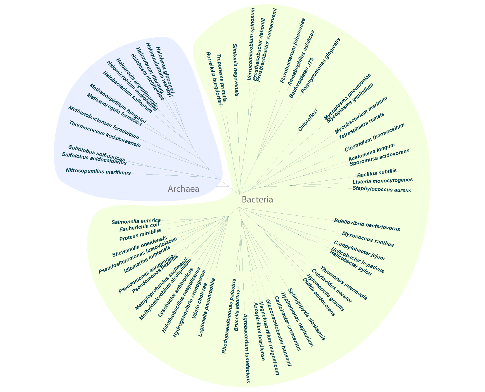

# Phylogenetic Tree

A species is a unique group of organisms and is the first rung on the ladder of taxonomic classifications that stretches all the way up to the three domains of life: Bacteria, Archaea and Eukarya. How *exactly* a species is defined, though, is a surprisingly complicated question, especially for single-celled organisms. For most animals, species boundaries are defined by the infertility of offspring from matings across that boundary. This doesn't always work, though, and many species are defined by geographical, rather than reproductive, separation. For organisms that reproduce asexually, the boundaries are even more nebulous and often simply reflect a fairly arbitrary degree of difference, either morphological or genetic. Also, remember that bacteria and archaea frequently exchange genes, or larger stretches of DNA, through horizontal gene transfer (for an example that may be familiar, think of the transfer of antibiotic resistance). This further blurs the lines between species. In an extreme view, perhaps we should think of environments less as collections of species than as pools of genes temporarily stored in a variety of containers. Still, despite its inexactness, taxonomic classification provides a useful way to trace biological traits so we can begin to answer questions like how the machines you see in this book may have evolved.  

This phylogenetic tree shows the relatedness of the species in this book. The length of the branches separating two species from their last common ancestor is proportional to the amount of time that they've been evolving separately. Remember that individual species of Bacteria and Archaea can be as evolutionarily divergent from one another as they are from us. The deeper we go into the past, toward the center of the tree, the less accurate the predictions of relatedness become. The branch point between Bacteria/Archaea and Eukaryotes is particularly hazy, and a topic of lively debate. We're still discovering new species, and even higher-order clades, and the computational tools we have to detect genetic relationships are improving, so this tree, too, will continue to evolve.

<style type="text/css">
	.st0{fill:#E9EFFF;}
	.st1{fill:#76777B;}
	.st2{font-family:'MyriadPro-Regular';}
	.st3{font-size:32px;}
	.st4{fill:#F4FFDE;}
	.st5{fill:none;stroke:#003B4C;stroke-width:0.2672;stroke-linecap:round;stroke-miterlimit:2.6723;}

		.st6{fill:none;stroke:#AAAAAA;stroke-width:0.5345;stroke-linecap:round;stroke-miterlimit:2.6723;stroke-dasharray:1.3362,2.6723;stroke-dashoffset:2;}
	.st7{fill:#003B4C;}
	.st8{font-family:'Arial-BoldItalicMT';}
	.st9{font-size:18px;}
	.st10{fill:none;stroke:#003B4C;stroke-linecap:round;stroke-miterlimit:10;}
	.st11{display:none;fill:#505050;enable-background:new    ;}
	.st12{font-family:'Arial-BoldMT';}
	.st13{font-size:14px;}
	.st14{opacity:0;fill:#003B4C;}
</style>


```{r tree, echo = FALSE}
if (knitr:::is_html_output()){
  knitr::asis_output(htmltools::htmlPreserve('
  <!-- Generator: Adobe Illustrator 24.2.3, SVG Export Plug-In . SVG Version: 6.00 Build 0)  -->
  <svg version="1.1" xmlns="http://www.w3.org/2000/svg" xmlns:xlink="http://www.w3.org/1999/xlink" x="0px" y="0px"
	 viewBox="0 0 1660 1342.7" style="enable-background:new 0 0 1660 1342.7;" xml:space="preserve">
  <g id="Archaea">
	<path class="st0" d="M759.8,608.4c10.1-32-24.9-135.5-41.7-181.5c-17.5-47.6-68.3-298.7-154-300.3c-48-0.9-208.1,14.2-317.1,172.2
		c-66.7,96.7-84.3,293.8-33,325c88.2,53.6,150.9,58.3,247,63.1C563.7,692.1,731.9,697.1,759.8,608.4z"/>
	<text transform="matrix(1 0 0 1 573.6507 656.7684)" class="st1 st2 st3">Archaea</text>
  </g>
  <g id="Bacteria">
	<path class="st4" d="M796,649.8c1-7-43-202-63-262s-99.5-206.2-64-248c30-35.4,130.8-140,280.8-124s505.8,204.6,522.2,550.8
		c23.8,503.2-331.1,755.6-623.8,758.7c-285,3-479.3-228.5-527.3-366.5s-8-209.9,5-225.8c41.3-50.8,163.1-19.4,290.5-31.7
		C714.9,691.7,771.3,692.9,796,649.8"/>
	<text transform="matrix(1 0 0 1 827.6189 693.2763)" class="st1 st2 st3">Bacteria</text>
  </g>
  <g id="Layer_1">
	<g id="mainHolder_1_" transform="translate(738.88296,574.25562) scale(0.26723,0.26723)">
		<g id="rangeHolder_1_">
		</g>
		<g id="pruningHolder_1_">
		</g>
		<g id="treeHolder_1_">
			<g>
				<path class="st5" d="M57.8,931.9l53-158"/>
			</g>
			<g>
				<path class="st5" d="M-515-482.5l112.3,123.2"/>
			</g>
			<g>
				<path class="st6" d="M-529.3,1426.4l255.5-307.7"/>
				<text transform="matrix(2.3906 -2.8789 2.8789 2.3906 -952.8766 1959.8527)" class="st7 st8 st9">Methylomicrobium alcaliphilum</text>
				<path class="st5" d="M-273.8,1118.7l106.5-128.2"/>
			</g>
			<g>
				<path class="st5" d="M464.8,976.6l-67.3-152.5"/>
			</g>
			<g>
				<path class="st6" d="M-899.8,688.2l399.6-18.5"/>
				<text transform="matrix(3.7381 -0.1728 0.1728 3.7381 -1337.9924 723.4227)" class="st7 st8 st9">Salmonella enterica</text>
				<path class="st5" d="M-500.3,669.7l166.5-7.7"/>
			</g>
			<g>
				<path class="st5" d="M207.8-148.6l30.6,163.8"/>
			</g>
			<g>
				<path class="st6" d="M1652.7-212.8L1378.3-91.6"/>
				<text transform="matrix(3.4232 -1.5115 1.5115 3.4232 1658.6843 -199.2162)" class="st7 st8 st9">Clostridium thermocellum</text>
				<path class="st5" d="M1378.3-91.6l-152.5,67.3"/>
			</g>
			<g>
				<path class="st5" d="M794.8,946.9L666.5,840.5"/>
			</g>
			<g>
				<path class="st6" d="M1513.5,679.8l-396.2-55.3"/>
				<a href="_book/2-10-nucleoid.html" >
					<text transform="matrix(3.7062 0.517 -0.517 3.7062 1511.2981 694.7806)" class="st7 st8 st9">Bdellovibrio bacteriovorus</text>
				</a>
				<path class="st5" d="M1117.3,624.5l-165.1-23"/>
			</g>
			<g>
				<path class="st5" d="M1114,206.6l-165.1,23"/>
			</g>
			<g>
				<path class="st6" d="M-893.6,755.6l396.2-55.3"/>
				<text transform="matrix(3.7062 -0.517 0.517 3.7062 -1235.4194 818.3573)" class="st7 st8 st9">Escherichia coli</text>
				<path class="st5" d="M-497.4,700.3l165.1-23"/>
			</g>
			<g>
				<path class="st6" d="M-175.2,1627.3L-48.1,1248"/>
				<text transform="matrix(1.1892 -3.5481 3.5481 1.1892 -266.6989 1947.3381)" class="st7 st8 st9">Vibrio cholerae</text>
				<path class="st5" d="M-48.1,1248l53-158"/>
			</g>
			<g>
				<path class="st5" d="M0,242.5L0,242.5"/>
			</g>
			<g>
				<path class="st5" d="M735.5,100.1l-141.7,87.7"/>
			</g>
			<g>
				<path class="st5" d="M1281.9,245l-166.5-7.7"/>
			</g>
			<g>
				<path class="st5" d="M-163.6,677.1l162.2-38.2"/>
			</g>
			<g>
				<path class="st5" d="M414.8-649.8l-7.7,166.5"/>
			</g>
			<g>
				<path class="st5" d="M276.6-655.5l7.7,166.5"/>
			</g>
			<g>
				<path class="st6" d="M1807.3,109.9l-198.1,27.6"/>
				<text transform="matrix(3.7062 -0.517 0.517 3.7062 1809.4838 124.597)" class="st7 st8 st9">Bacillus subtilis</text>
				<path class="st5" d="M1609.2,137.5l-165.1,23"/>
			</g>
			<g>
				<path class="st5" d="M-24.6,890.9l94.2-137.5"/>
			</g>
			<g>
				<path class="st5" d="M292-322.5l7.7,166.5"/>
			</g>
			<g>
				<path class="st5" d="M791.8-714.5l-67.3,152.5"/>
			</g>
			<g>
				<path class="st6" d="M544.6-1101.4l-68.7,292"/>
				<text transform="matrix(0.8568 -3.6427 3.6427 0.8568 559.3029 -1097.9431)" class="st7 st8 st9">Prosthecobacter vanneervenii</text>
				<path class="st5" d="M475.9-809.4l-38.2,162.2"/>
			</g>
			<g>
				<path class="st5" d="M681.4-578.7l-53,158"/>
			</g>
			<g>
				<path class="st5" d="M575.5-262.7l-53,158"/>
			</g>
			<g>
				<path class="st5" d="M397.5,824.1l-67.3-152.5"/>
			</g>
			<g>
				<path class="st5" d="M-359.1-390.7l74.3,149.2"/>
			</g>
			<g>
				<path class="st6" d="M849.2,1603.5l-194.6-349.4"/>
				<text transform="matrix(1.8209 3.2692 -3.2692 1.8209 835.854 1610.7684)" class="st7 st8 st9">Hyphomonas neptunium</text>
				<path class="st5" d="M654.5,1254.1l-81.1-145.6"/>
			</g>
			<g>
				<path class="st6" d="M-355.3,1547.8l194.6-349.4"/>
				<a href="_book/4-9-storage-contd-.html#Carboxysome-granule_connections" >
					<text transform="matrix(1.8209 -3.2692 3.2692 1.8209 -657.374 2120.6394)" class="st7 st8 st9">Halothiobacillus neapolitanus</text>
				</a>
				<path class="st5" d="M-160.7,1198.3l81.1-145.6"/>
			</g>
			<g>
				<path class="st6" d="M198.1,1729.5l55.3-396.2"/>
				<text transform="matrix(0.517 -3.7062 3.7062 0.517 121.4393 2386.8789)" class="st7 st8 st9">Rhodopseudomonas palustris</text>
				<path class="st5" d="M253.4,1333.3l23-165.1"/>
			</g>
			<g>
				<path class="st5" d="M411.2,817.3l-81.1-145.6"/>
			</g>
			<g>
				<path class="st5" d="M734.4-736.8l-53,158"/>
			</g>
			<g>
				<path class="st5" d="M82.6,761.5l81.1-145.6"/>
			</g>
			<g>
				<path class="st5" d="M771.9,645.9l-162.2-38.2"/>
			</g>
			<g>
				<path class="st5" d="M307.4,10.5L315,177"/>
			</g>
			<g>
				<path class="st5" d="M-530.9-465.9l128.2,106.5"/>
			</g>
			<g>
				<path class="st5" d="M-459.1,57.8l163.8,30.6"/>
			</g>
			<g>
				<path class="st5" d="M-84.2,24.2L33.7,142"/>
			</g>
			<g>
				<path class="st5" d="M-419.3-546.1l60.2,155.4"/>
			</g>
			<g>
				<path class="st5" d="M424.3,809.2l-94.2-137.5"/>
			</g>
			<g>
				<path class="st6" d="M-842.1,969.2l379.3-127.1"/>
				<text transform="matrix(3.5481 -1.1892 1.1892 3.5481 -1322.3186 1145.9863)" class="st7 st8 st9">Shewanella oneidensis</text>
				<path class="st5" d="M-462.8,842.1l158-53"/>
			</g>
			<g>
				<path class="st5" d="M1444.1,160.5l-165.1,23"/>
			</g>
			<g>
				<path class="st6" d="M370.2,1870.4l-9.2-199.8"/>
				<text transform="matrix(0.1728 3.7381 -3.7381 0.1728 354.9727 1871.0624)" class="st7 st8 st9">Agrobacterium tumefaciens</text>
				<path class="st5" d="M360.9,1670.6l-7.7-166.5"/>
			</g>
			<g>
				<path class="st5" d="M-716.3-187.7l158,53"/>
			</g>
			<g>
				<path class="st6" d="M1069.7-468.1L558.6,147.4"/>
				<text transform="matrix(2.3906 -2.8789 2.8789 2.3906 1081.041 -458.3751)" class="st7 st8 st9">Chloroflexi</text>
				<path class="st5" d="M558.6,147.4L452.1,275.6"/>
			</g>
			<g>
				<path class="st5" d="M-141.2,750.5l152.5-67.3"/>
			</g>
			<g>
				<path class="st6" d="M-1414-91l297.1,41.4"/>
				<text transform="matrix(3.7062 0.517 -0.517 3.7062 -1977.7355 -154.3526)" class="st7 st8 st9">Sulfolobus acidocaldarius</text>
				<path class="st5" d="M-1116.9-49.5l165.1,23"/>
			</g>
			<g>
				<path class="st5" d="M603.6-250.3l-81.1,145.6"/>
			</g>
			<g>
				<path class="st5" d="M522.5-104.7L448.2,44.5"/>
			</g>
			<g>
				<path class="st5" d="M757.1,985.4L650.6,857.1"/>
			</g>
			<g>
				<path class="st5" d="M33.7,142l133,100.4"/>
			</g>
			<g>
				<path class="st5" d="M421.3,991.9l-53-158"/>
			</g>
			<g>
				<path class="st6" d="M1.7-1024.7l91.6,389.4"/>
				<text transform="matrix(0.8568 3.6427 -3.6427 0.8568 -122.2756 -1486.448)" class="st7 st8 st9">Borreliella burgdorferi</text>
				<path class="st5" d="M93.3-635.3L131.5-473"/>
			</g>
			<g>
				<path class="st5" d="M-389.1-110.4l152.5,67.3"/>
			</g>
			<g>
				<path class="st6" d="M-1363.4,62.1l399.6,18.5"/>
				<text transform="matrix(3.7381 0.1728 -0.1728 3.7381 -1924.7313 50.9366)" class="st7 st8 st9">Nitrosopumilus maritimus</text>
				<path class="st5" d="M-963.8,80.5l166.5,7.7"/>
			</g>
			<g>
				<path class="st6" d="M502.2-1109.3l-41.4,297.1"/>
				<text transform="matrix(0.517 -3.7062 3.7062 0.517 517.0012 -1107.1393)" class="st7 st8 st9">Prosthecobacter debontii</text>
				<path class="st5" d="M460.8-812.2l-23,165.1"/>
			</g>
			<g>
				<path class="st5" d="M1073.4,43l-152.5,67.3"/>
			</g>
			<g>
				<path class="st5" d="M813.3,922.4l-137.5-94.2"/>
			</g>
			<g>
				<path class="st5" d="M-284.9-241.5l94.2,137.5"/>
			</g>
			<g>
				<path class="st5" d="M284.3-489l7.7,166.5"/>
			</g>
			<g>
				<path class="st5" d="M-749.1-467.9l137.5,94.2"/>
			</g>
			<g>
				<path class="st5" d="M622.1,555.5l-165.1-23"/>
			</g>
			<g>
				<path class="st6" d="M1748.1,266.5l-299.7-13.9"/>
				<text transform="matrix(3.7381 0.1728 -0.1728 3.7381 1747.397 281.3148)" class="st7 st8 st9">Staphylococcus aureus</text>
				<path class="st5" d="M1448.4,252.7l-166.5-7.7"/>
			</g>
			<g>
				<path class="st5" d="M-1.3,638.9l165.1-23"/>
			</g>
			<g>
				<path class="st5" d="M-38.2,1073.3l67.3-152.5"/>
			</g>
			<g>
				<path class="st5" d="M-60.8,862.2L51.5,739.1"/>
			</g>
			<g>
				<path class="st5" d="M612.7,1084.2l-94.2-137.5"/>
			</g>
			<g>
				<path class="st6" d="M1477.6,1041.3l-274.4-121.2"/>
				<text transform="matrix(3.4232 1.5115 -1.5115 3.4232 1471.402 1054.9548)" class="st7 st8 st9">Helicobacter hepaticus</text>
				<path class="st5" d="M1203.2,920.2l-152.5-67.3"/>
			</g>
			<g>
				<path class="st6" d="M1748.1,192.6l-299.7,13.9"/>
				<text transform="matrix(3.7381 -0.1728 0.1728 3.7381 1748.5795 207.6314)" class="st7 st8 st9">Listeria monocytogenes</text>
				<path class="st5" d="M1448.4,206.5l-166.5,7.7"/>
			</g>
			<g>
				<path class="st5" d="M-622.9,27.1l163.8,30.6"/>
			</g>
			<g>
				<path class="st6" d="M83.5-1039.9l55.3,396.2"/>
				<text transform="matrix(0.517 3.7062 -3.7062 0.517 9.4622 -1462.7048)" class="st7 st8 st9">Treponema primitia</text>
				<path class="st5" d="M138.7-643.8l23,165.1"/>
			</g>
			<g>
				<path class="st6" d="M761,1647.4l-161.6-365.9"/>
				<text transform="matrix(1.5115 3.4232 -3.4232 1.5115 747.1567 1653.3468)" class="st7 st8 st9">Caulobacter crescentus</text>
				<path class="st5" d="M599.4,1281.5l-67.3-152.5"/>
			</g>
			<g>
				<path class="st5" d="M368.3,833.9l-38.2-162.2"/>
			</g>
			<g>
				<path class="st5" d="M184.8-313.6l23,165.1"/>
			</g>
			<g>
				<path class="st5" d="M-630.9,95.9l166.5,7.7"/>
			</g>
			<g>
				<path class="st5" d="M-611.6-373.7l137.5,94.2"/>
			</g>
			<g>
				<path class="st6" d="M1458.4,1079.9l-262.1-146"/>
				<text transform="matrix(3.2692 1.8209 -1.8209 3.2692 1451.0491 1092.809)" class="st7 st8 st9">Helicobacter pylori</text>
				<path class="st5" d="M1196.3,933.9l-145.6-81.1"/>
			</g>
			<g>
				<path class="st5" d="M69.6,753.4l94.2-137.5"/>
			</g>
			<g>
				<path class="st6" d="M500.2,1724L445,1327.9"/>
				<text transform="matrix(0.517 3.7062 -3.7062 0.517 485.4968 1725.9868)" class="st7 st8 st9">Azospirillum brasilense</text>
				<path class="st5" d="M445,1327.9l-23-165.1"/>
			</g>
			<g>
				<path class="st5" d="M1026.7-62.1L881.1,19"/>
			</g>
			<g>
				<path class="st5" d="M-951.8-26.5l165.1,23"/>
			</g>
			<g>
				<path class="st6" d="M1533-446.2l-247.5,169.5"/>
				<text transform="matrix(3.0872 -2.1148 2.1148 3.0872 1541.6931 -433.7245)" class="st7 st8 st9">Mycobacterium marinum</text>
				<path class="st5" d="M1285.5-276.6L1148-182.4"/>
			</g>
			<g>
				<path class="st5" d="M29.1,920.8l67.3-152.5"/>
			</g>
			<g>
				<path class="st5" d="M-134.3,764.3l145.6-81.1"/>
			</g>
			<g>
				<path class="st5" d="M-146.7,736.2l158-53"/>
			</g>
			<g>
				<path class="st5" d="M628.5-420.7l-53,158"/>
			</g>
			<g>
				<path class="st5" d="M-541.1-669.9l94.2,137.5"/>
			</g>
			<g>
				<path class="st5" d="M616.7-242.2l-94.2,137.5"/>
			</g>
			<g>
				<path class="st5" d="M166.7,242.5H0"/>
			</g>
			<g>
				<path class="st5" d="M-446.9-532.4l87.7,141.7"/>
			</g>
			<g>
				<path class="st5" d="M-167.3,990.4l106.5-128.2"/>
			</g>
			<g>
				<path class="st5" d="M-474.1-279.5l141.7,87.7"/>
			</g>
			<g>
				<path class="st5" d="M163.7,615.9L292,509.4"/>
			</g>
			<g>
				<path class="st5" d="M-295.2,88.4l163.8,30.6"/>
			</g>
			<g>
				<path class="st5" d="M-400.2-81.7l158,53"/>
			</g>
			<g>
				<path class="st5" d="M452.1,275.6l-152.5,67.3"/>
			</g>
			<g>
				<path class="st5" d="M710.9-379.7l-94.2,137.5"/>
			</g>
			<g>
				<path class="st5" d="M724.5-562.1l-67.3,152.5"/>
			</g>
			<g>
				<path class="st5" d="M-178.7,980.1l117.9-117.9"/>
			</g>
			<g>
				<path class="st5" d="M1281.9,214.2l-166.5,7.7"/>
			</g>
			<g>
				<path class="st5" d="M1279.1,183.5l-165.1,23"/>
			</g>
			<g>
				<path class="st5" d="M698.5,51L575.3,163.3"/>
			</g>
			<g>
				<path class="st5" d="M950.8,1016.5l-137.5-94.2"/>
			</g>
			<g>
				<path class="st5" d="M345.5,1337.6l-7.7-166.5"/>
			</g>
			<g>
				<path class="st5" d="M-332.4-191.8l141.7,87.7"/>
			</g>
			<g>
				<path class="st6" d="M-1253.6-367.7l379.3,127.1"/>
				<text transform="matrix(3.5481 1.1892 -1.1892 3.5481 -1888.1014 -564.6577)" class="st7 st8 st9">Thermococcus kodakaraensis</text>
				<path class="st5" d="M-874.3-240.6l158,53"/>
			</g>
			<g>
				<path class="st5" d="M934.1,684.1l-162.2-38.2"/>
			</g>
			<g>
				<path class="st5" d="M-619.7-360.6l145.6,81.1"/>
			</g>
			<g>
				<path class="st5" d="M407.2-483.3l-23,165.1"/>
			</g>
			<g>
				<path class="st5" d="M675.8,828.2L538.3,734"/>
			</g>
			<g>
				<path class="st6" d="M-1018.2-870.5l230.8,191.7"/>
				<text transform="matrix(2.8789 2.3906 -2.3906 2.8789 -1453.3738 -1212.0834)" class="st7 st8 st9">Halobacterium salinarum</text>
				<path class="st5" d="M-787.4-678.8l128.2,106.5"/>
			</g>
			<g>
				<path class="st5" d="M49.3,1102.6l38.2-162.2"/>
			</g>
			<g>
				<path class="st6" d="M1580-370.3l-262.1,146"/>
				<text transform="matrix(3.2692 -1.8209 1.8209 3.2692 1587.1259 -357.1916)" class="st7 st8 st9">Tetrasphaera remsis</text>
				<path class="st5" d="M1318-224.3l-145.6,81.1"/>
			</g>
			<g>
				<path class="st5" d="M292,509.4l7.7-166.5"/>
			</g>
			<g>
				<path class="st5" d="M-372.8,1011.4l137.5-94.2"/>
			</g>
			<g>
				<path class="st5" d="M787.2,578.5l-165.1-23"/>
			</g>
			<g>
				<path class="st5" d="M353.2,1504.1l-7.7-166.5"/>
			</g>
			<g>
				<path class="st5" d="M1259.1,70l-162.2,38.2"/>
			</g>
			<g>
				<path class="st6" d="M1427-583.9l-230.8,191.7"/>
				<text transform="matrix(2.8789 -2.3906 2.3906 2.8789 1436.703 -572.5849)" class="st7 st8 st9">Mycoplasma genitalium</text>
				<path class="st5" d="M1196.2-392.3L1068-285.8"/>
			</g>
			<g>
				<path class="st5" d="M575.3,163.3L452.1,275.6"/>
			</g>
			<g>
				<path class="st6" d="M-1134.1-731.6l247.5,169.5"/>
				<text transform="matrix(3.0872 2.1148 -2.1148 3.0872 -1624.0001 -1048.9208)" class="st7 st8 st9">Methanospirillum hungatei</text>
				<path class="st5" d="M-886.6-562.1l137.5,94.2"/>
			</g>
			<g>
				<path class="st5" d="M110.8,773.9l53-158"/>
			</g>
			<g>
				<path class="st6" d="M1615.5,844.4l-194.7-45.8"/>
				<text transform="matrix(3.6427 0.8568 -0.8568 3.6427 1612.1588 858.9922)" class="st7 st8 st9">Myxococcus xanthus</text>
				<path class="st5" d="M1420.8,798.6l-162.2-38.2"/>
			</g>
			<g>
				<path class="st6" d="M-80.5,1654.2l91.6-389.4"/>
				<text transform="matrix(0.8568 -3.6427 3.6427 0.8568 -186.7123 2171.8572)" class="st7 st8 st9">Legionella pneumophila</text>
				<path class="st5" d="M11.1,1264.8l38.2-162.2"/>
			</g>
			<g>
				<path class="st5" d="M-765.3-441.7l145.6,81.1"/>
			</g>
			<g>
				<path class="st5" d="M881.1,19l-145.6,81.1"/>
			</g>
			<g>
				<path class="st6" d="M-919.6-969.8L-727.9-739"/>
				<text transform="matrix(2.3906 2.8789 -2.8789 2.3906 -1282.577 -1383.7577)" class="st7 st8 st9">Haloarcula argentinensis</text>
				<path class="st5" d="M-727.9-739l106.5,128.2"/>
			</g>
			<g>
				<path class="st5" d="M1148-182.4l-137.5,94.2"/>
			</g>
			<g>
				<path class="st5" d="M299.7-156l7.7,166.5"/>
			</g>
			<g>
				<path class="st5" d="M948.9,229.6l-166.5,7.7"/>
			</g>
			<g>
				<path class="st5" d="M51.5,739.1l112.3-123.2"/>
			</g>
			<g>
				<path class="st5" d="M330.1,1004.6l-7.7-166.5"/>
			</g>
			<g>
				<path class="st6" d="M1106.5-957.2l-113,165"/>
				<text transform="matrix(2.1148 -3.0872 3.0872 2.1148 1118.9628 -948.504)" class="st7 st8 st9">Porphyromonas gingivalis</text>
				<path class="st5" d="M993.5-792.2l-94.2,137.5"/>
			</g>
			<g>
				<path class="st5" d="M873,5.9l-137.5,94.2"/>
			</g>
			<g>
				<path class="st6" d="M-439.1,1495.9l226.1-330"/>
				<text transform="matrix(2.1148 -3.0872 3.0872 2.1148 -713.0132 1922.6213)" class="st7 st8 st9">Lysobacter antibioticus</text>
				<path class="st5" d="M-213,1165.9l94.2-137.5"/>
			</g>
			<g>
				<path class="st5" d="M-486.7-698.6l67.3,152.5"/>
			</g>
			<g>
				<path class="st5" d="M-786.7-3.5l163.8,30.6"/>
			</g>
			<g>
				<path class="st6" d="M932.9,1551.7l-226.1-330"/>
				<text transform="matrix(2.1148 3.0872 -3.0872 2.1148 920.747 1560.2092)" class="st7 st8 st9">Sphingopyxis alaskensis</text>
				<path class="st5" d="M706.9,1221.7l-94.2-137.5"/>
			</g>
			<g>
				<path class="st5" d="M-846.5-312.4l152.5,67.3"/>
			</g>
			<g>
				<path class="st5" d="M518.5,946.7l-94.2-137.5"/>
			</g>
			<g>
				<path class="st6" d="M-804.8-1054.9l169.5,247.5"/>
				<text transform="matrix(2.1148 3.0872 -3.0872 2.1148 -1091.8912 -1447.6497)" class="st7 st8 st9">Halohasta litchfieldiae</text>
				<path class="st5" d="M-635.3-807.4l94.2,137.5"/>
			</g>
			<g>
				<path class="st5" d="M-297.9,111.3l166.5,7.7"/>
			</g>
			<g>
				<path class="st5" d="M338.1,11.9L315,177"/>
			</g>
			<g>
				<path class="st5" d="M1068.4,810.2l-158-53"/>
			</g>
			<g>
				<path class="st5" d="M936.6,153.8l-160.3,45.6"/>
			</g>
			<g>
				<path class="st6" d="M1230.7,1308.9L923,1053.4"/>
				<text transform="matrix(2.8789 2.3906 -2.3906 2.8789 1220.9336 1320.6083)" class="st7 st8 st9">Cupriavidus necator</text>
				<path class="st5" d="M923,1053.4L794.8,946.9"/>
			</g>
			<g>
				<path class="st5" d="M-304.8,789.1l158-53"/>
			</g>
			<g>
				<path class="st5" d="M-472.3-704.2l53,158"/>
			</g>
			<g>
				<path class="st6" d="M-775,1121.2l349.4-194.6"/>
				<text transform="matrix(3.2692 -1.8209 1.8209 3.2692 -1163.6388 1354.6371)" class="st7 st8 st9">Idiomarina loihiensis</text>
				<path class="st5" d="M-425.5,926.5l145.6-81.1"/>
			</g>
			<g>
				<path class="st6" d="M960.5-890.9L765.8-541.5"/>
				<text transform="matrix(1.8209 -3.2692 3.2692 1.8209 973.5383 -883.8269)" class="st7 st8 st9">Bacteroidetes JT5</text>
				<path class="st5" d="M765.8-541.5l-81.1,145.6"/>
			</g>
			<g>
				<path class="st5" d="M30.7,716.3l133-100.4"/>
			</g>
			<g>
				<path class="st6" d="M-1403.2-148.5l292,68.7"/>
				<text transform="matrix(3.6427 0.8568 -0.8568 3.6427 -1893.5703 -248.3864)" class="st7 st8 st9">Sulfolobus solfataricus</text>
				<path class="st5" d="M-1111.2-79.8L-949-41.6"/>
			</g>
			<g>
				<path class="st5" d="M125.6,778.1l38.2-162.2"/>
			</g>
			<g>
				<path class="st5" d="M87.4,940.4l38.2-162.2"/>
			</g>
			<g>
				<path class="st5" d="M337.8,1171.1l-7.7-166.5"/>
			</g>
			<g>
				<path class="st5" d="M589.9-257.1l-67.3,152.5"/>
			</g>
			<g>
				<path class="st5" d="M437.1,1160l-38.2-162.2"/>
			</g>
			<g>
				<path class="st5" d="M-79.6,1052.7L1.5,907.1"/>
			</g>
			<g>
				<path class="st5" d="M457,532.4l-165.1-23"/>
			</g>
			<g>
				<path class="st5" d="M1096.3,722.3l-162.2-38.2"/>
			</g>
			<g>
				<path class="st5" d="M-118.8,1028.4l94.2-137.5"/>
			</g>
			<g>
				<path class="st5" d="M1050.7,852.8l-149.2-74.3"/>
			</g>
			<g>
				<path class="st5" d="M1225.8-24.3L1073.4,43"/>
			</g>
			<g>
				<path class="st5" d="M650.6,857.1L538.3,734"/>
			</g>
			<g>
				<path class="st5" d="M-528-678l81.1,145.6"/>
			</g>
			<g>
				<path class="st5" d="M307,1171.1l7.7-166.5"/>
			</g>
			<g>
				<path class="st5" d="M276.4,1168.3l23-165.1"/>
			</g>
			<g>
				<path class="st5" d="M1172.4-143.2l-145.6,81.1"/>
			</g>
			<g>
				<path class="st5" d="M-102.3,816.8l133-100.4"/>
			</g>
			<g>
				<path class="st5" d="M609.6,607.8l-162.2-38.2"/>
			</g>
			<g>
				<path class="st5" d="M-242.2-28.8l158,53"/>
			</g>
			<g>
				<path class="st5" d="M657.2-409.6l-67.3,152.5"/>
			</g>
			<g>
				<path class="st5" d="M805.1-517.2l-94.2,137.5"/>
			</g>
			<g>
				<path class="st5" d="M1115.4,221.9l-166.5,7.7"/>
			</g>
			<g>
				<path class="st5" d="M-464.4,103.6l166.5,7.7"/>
			</g>
			<g>
				<path class="st6" d="M-812,1046.7l365.9-161.6"/>
				<text transform="matrix(3.4232 -1.5115 1.5115 3.4232 -1492.6045 1363.4554)" class="st7 st8 st9">Pseudoalteromonas luteoviolacea</text>
				<path class="st5" d="M-446.1,885.2l152.5-67.3"/>
			</g>
			<g>
				<path class="st5" d="M96.4,768.4l67.3-152.5"/>
			</g>
			<g>
				<path class="st5" d="M-402.7-359.4l117.9,117.9"/>
			</g>
			<g>
				<path class="st6" d="M-787.5-1144l97.3,174.7"/>
				<text transform="matrix(1.8209 3.2692 -3.2692 1.8209 -1021.2067 -1532.3893)" class="st7 st8 st9">Halorubrum litoreum</text>
				<path class="st5" d="M-690.2-969.2l81.1,145.6"/>
			</g>
			<g>
				<path class="st6" d="M1398-615.8l-212.1,212.1"/>
				<text transform="matrix(2.6461 -2.6461 2.6461 2.6461 1408.7113 -605.0438)" class="st7 st8 st9">Mycoplasma pneumoniae</text>
				<path class="st5" d="M1185.8-403.7L1068-285.8"/>
			</g>
			<g>
				<path class="st5" d="M1258.6,760.4l-162.2-38.2"/>
			</g>
			<g>
				<path class="st5" d="M910.3,757.2l-158-53"/>
			</g>
			<g>
				<path class="st5" d="M474.2,1149.9l-53-158"/>
			</g>
			<g>
				<path class="st5" d="M684.7-395.9l-81.1,145.6"/>
			</g>
			<g>
				<path class="st5" d="M899.3-654.7l-94.2,137.5"/>
			</g>
			<g>
				<path class="st5" d="M752.3,704.3l-152.5-67.3"/>
			</g>
			<g>
				<path class="st6" d="M1169.1,1375.7l-282.8-282.8"/>
				<text transform="matrix(2.6461 2.6461 -2.6461 2.6461 1158.672 1386.4475)" class="st7 st8 st9">Hylemonella gracilis</text>
				<path class="st5" d="M886.3,1092.9L768.4,975"/>
			</g>
			<g>
				<path class="st6" d="M-675.2-1125.5L-554-851.1"/>
				<text transform="matrix(1.5115 3.4232 -3.4232 1.5115 -898.902 -1594.993)" class="st7 st8 st9">Haloquadratum walsbyi</text>
				<path class="st5" d="M-554-851.1l67.3,152.5"/>
			</g>
			<g>
				<path class="st5" d="M1115.4,237.3l-166.5-7.7"/>
			</g>
			<g>
				<path class="st5" d="M-659.1-572.3l128.2,106.5"/>
			</g>
			<g>
				<path class="st5" d="M398.9,997.7l-30.6-163.8"/>
			</g>
			<g>
				<path class="st6" d="M1335.8,1280.3l-247.5-169.5"/>
				<text transform="matrix(3.0872 2.1148 -2.1148 3.0872 1327.4044 1292.8361)" class="st7 st8 st9">Thiomonas intermedia</text>
				<path class="st5" d="M1088.3,1110.7l-137.5-94.2"/>
			</g>
			<g>
				<path class="st5" d="M361.1-153.2l-23,165.1"/>
			</g>
			<g>
				<path class="st5" d="M599.8,636.9l-152.5-67.3"/>
			</g>
			<g>
				<path class="st5" d="M-621.5-610.8L-515-482.5"/>
			</g>
			<g>
				<path class="st6" d="M-620.6-1146.6l95.3,284.4"/>
				<text transform="matrix(1.1892 3.5481 -3.5481 1.1892 -770.0398 -1545.0615)" class="st7 st8 st9">Haloferax gibbonsii</text>
				<path class="st5" d="M-525.3-862.2l53,158"/>
			</g>
			<g>
				<path class="st6" d="M-757.8,1275.1l247.5-169.5"/>
				<text transform="matrix(3.0872 -2.1148 2.1148 3.0872 -1228.3972 1615.9059)" class="st7 st8 st9">Pseudomonas aeruginosa</text>
				<path class="st5" d="M-510.3,1105.6l137.5-94.2"/>
			</g>
			<g>
				<path class="st5" d="M169.6-310.8l38.2,162.2"/>
			</g>
			<g>
				<path class="st5" d="M768.4,975L650.6,857.1"/>
			</g>
			<g>
				<path class="st5" d="M-325.8,715.2l162.2-38.2"/>
			</g>
			<g>
				<path class="st6" d="M850.9-1084.4l-63.6,189.6"/>
				<text transform="matrix(1.1892 -3.5481 3.5481 1.1892 865.147 -1079.7183)" class="st7 st8 st9">Flavobacterium johnsoniae</text>
				<path class="st5" d="M787.4-894.8l-53,158"/>
			</g>
			<g>
				<path class="st5" d="M374,193.7l-74.3,149.2"/>
			</g>
			<g>
				<path class="st5" d="M901.5,778.6l-149.2-74.3"/>
			</g>
			<g>
				<path class="st5" d="M492.3,962.9l-81.1-145.6"/>
			</g>
			<g>
				<path class="st5" d="M-797.4,88.2l166.5,7.7"/>
			</g>
			<g>
				<path class="st5" d="M-333.8,662l166.5-7.7"/>
			</g>
			<g>
				<path class="st6" d="M1713.4-36.9l-292,68.7"/>
				<text transform="matrix(3.6427 -0.8568 0.8568 3.6427 1716.8499 -22.1683)" class="st7 st8 st9">Sporomusa acidovorans</text>
				<path class="st5" d="M1421.4,31.8L1259.1,70"/>
			</g>
			<g>
				<path class="st6" d="M255-1121.6L268.9-822"/>
				<text transform="matrix(0.1728 3.7381 -3.7381 0.1728 218.0134 -1592.9226)" class="st7 st8 st9">Simkania negevensis</text>
				<path class="st5" d="M268.9-822l7.7,166.5"/>
			</g>
			<g>
				<path class="st5" d="M532.1,1129.1l-67.3-152.5"/>
			</g>
			<g>
				<path class="st5" d="M1096.9,108.2l-160.3,45.6"/>
			</g>
			<g>
				<path class="st5" d="M-190.7-104L-84.2,24.2"/>
			</g>
			<g>
				<path class="st5" d="M593.8,187.9l-141.7,87.7"/>
			</g>
			<g>
				<path class="st6" d="M-962.8-930.4l212.1,212.1"/>
				<text transform="matrix(2.6461 2.6461 -2.6461 2.6461 -1401.6677 -1348.0098)" class="st7 st8 st9">Halomicrobium mukohataei</text>
				<path class="st5" d="M-750.7-718.2l117.9,117.9"/>
			</g>
			<g>
				<path class="st5" d="M384.1-318.2l-23,165.1"/>
			</g>
			<g>
				<path class="st6" d="M-1173-668.8l262.1,146"/>
				<text transform="matrix(3.2692 1.8209 -1.8209 3.2692 -1658.5936 -922.2932)" class="st7 st8 st9">Methanoregula formicica</text>
				<path class="st5" d="M-910.9-522.8l145.6,81.1"/>
			</g>
			<g>
				<path class="st5" d="M1.5,907.1l81.1-145.6"/>
			</g>
			<g>
				<path class="st6" d="M939.9-1049.9l-80.8,183"/>
				<text transform="matrix(1.5115 -3.4232 3.4232 1.5115 953.5048 -1043.9833)" class="st7 st8 st9">Amoebophilus asiaticus</text>
				<path class="st5" d="M859.1-867l-67.3,152.5"/>
			</g>
			<g>
				<path class="st5" d="M-632.8-600.4L-515-482.5"/>
			</g>
			<g>
				<path class="st5" d="M-609.1-823.6L-528-678"/>
			</g>
			<g>
				<path class="st5" d="M-279.9,845.4l145.6-81.1"/>
			</g>
			<g>
				<path class="st5" d="M616,245l-163.8,30.6"/>
			</g>
			<g>
				<path class="st5" d="M-131.4,119l165.1,23"/>
			</g>
			<g>
				<path class="st5" d="M415.1,621.7L292,509.4"/>
			</g>
			<g>
				<path class="st5" d="M944.8-173.5L821.6-61.2"/>
			</g>
			<g>
				<path class="st6" d="M436.4-1116l-13.9,299.7"/>
				<text transform="matrix(0.1728 -3.7381 3.7381 0.1728 451.3849 -1115.4594)" class="st7 st8 st9">Verrucomicrobium spinosum</text>
				<path class="st5" d="M422.5-816.3l-7.7,166.5"/>
			</g>
			<g>
				<path class="st6" d="M-267.1,1591.7l161.6-365.9"/>
				<text transform="matrix(1.5115 -3.4232 3.4232 1.5115 -511.732 2182.4272)" class="st7 st8 st9">Hydrogenovibrio crunogenus</text>
				<path class="st5" d="M-105.5,1225.8l67.3-152.5"/>
			</g>
			<g>
				<path class="st5" d="M-236.7-43.1l152.5,67.3"/>
			</g>
			<g>
				<path class="st5" d="M-235.3,917.2l133-100.4"/>
			</g>
			<g>
				<path class="st5" d="M11.3,683.2l152.5-67.3"/>
			</g>
			<g>
				<path class="st5" d="M776.3,199.4L616,245"/>
			</g>
			<g>
				<path class="st5" d="M666.5,840.5L538.3,734"/>
			</g>
			<g>
				<path class="st5" d="M-541.6-177.8l152.5,67.3"/>
			</g>
			<g>
				<path class="st5" d="M-694-245.1l152.5,67.3"/>
			</g>
			<g>
				<path class="st5" d="M821.6-61.2L698.5,51"/>
			</g>
			<g>
				<path class="st5" d="M4.9,1090l53-158"/>
			</g>
			<g>
				<path class="st6" d="M-1273.4-500.9L-999-379.7"/>
				<text transform="matrix(3.4232 1.5115 -1.5115 3.4232 -1892.2249 -757.7761)" class="st7 st8 st9">Methanobacterium formicicum</text>
				<path class="st5" d="M-999-379.7l152.5,67.3"/>
			</g>
			<g>
				<path class="st5" d="M315,177l-15.4,166"/>
			</g>
			<g>
				<path class="st5" d="M314.7,1004.6l7.7-166.5"/>
			</g>
			<g>
				<path class="st5" d="M952.2,601.5l-165.1-23"/>
			</g>
			<g>
				<path class="st5" d="M447.4,569.6L292,509.4"/>
			</g>
			<g>
				<path class="st5" d="M-332.3,677.3l165.1-23"/>
			</g>
			<g>
				<path class="st5" d="M421.9,1162.8l-23-165.1"/>
			</g>
			<g>
				<path class="st6" d="M-579.4,1380.8l282.8-282.8"/>
				<text transform="matrix(2.6461 -2.6461 2.6461 2.6461 -1010.8061 1833.7094)" class="st7 st8 st9">Methyloprofundus sedimenti</text>
				<path class="st5" d="M-296.5,1097.9l117.9-117.9"/>
			</g>
			<g>
				<path class="st5" d="M448.2,44.5L374,193.7"/>
			</g>
			<g>
				<path class="st5" d="M-293.6,817.9l152.5-67.3"/>
			</g>
			<g>
				<path class="st6" d="M1119.1,1421.3l-255.5-307.7"/>
				<text transform="matrix(2.3906 2.8789 -2.8789 2.3906 1107.672 1430.7222)" class="st7 st8 st9">Delftia acidovorans</text>
				<path class="st5" d="M863.5,1113.6L757.1,985.4"/>
			</g>
			<g>
				<path class="st5" d="M920.9,110.3l-152.5,67.3"/>
			</g>
			<g>
				<path class="st5" d="M-558.3-134.7l158,53"/>
			</g>
			<g>
				<path class="st5" d="M1254.9,55.2l-158,53"/>
			</g>
			<g>
				<path class="st6" d="M-877.4,845l389.4-91.6"/>
				<text transform="matrix(3.6427 -0.8568 0.8568 3.6427 -1233.6963 944.2642)" class="st7 st8 st9">Proteus mirabilis</text>
				<path class="st5" d="M-488,753.4l162.2-38.2"/>
			</g>
			<g>
				<path class="st5" d="M269,179.1l30.6,163.8"/>
			</g>
			<g>
				<path class="st5" d="M-949-41.6l162.2,38.2"/>
			</g>
			<g>
				<path class="st6" d="M1697.4-93.1L1412.9,2.2"/>
				<text transform="matrix(3.5481 -1.1892 1.1892 3.5481 1702.078 -78.8907)" class="st7 st8 st9">Acetonema longum</text>
				<path class="st5" d="M1412.9,2.2l-158,53"/>
			</g>
			<g>
				<path class="st6" d="M280.9,1737.2l18.5-399.6"/>
				<text transform="matrix(0.1728 -3.7381 3.7381 0.1728 279.1795 2098.5923)" class="st7 st8 st9">Brucella abortus</text>
				<path class="st5" d="M299.3,1337.6l7.7-166.5"/>
			</g>
			<g>
				<path class="st5" d="M161.7-478.7l23,165.1"/>
			</g>
			<g>
				<path class="st6" d="M1510.8,958.5l-284.4-95.3"/>
				<text transform="matrix(3.5481 1.1892 -1.1892 3.5481 1506.0826 972.6518)" class="st7 st8 st9">Campylobacter jejuni</text>
				<path class="st5" d="M1226.4,863.2l-158-53"/>
			</g>
			<g>
				<path class="st5" d="M238.4,15.3L269,179.1"/>
			</g>
			<g>
				<path class="st5" d="M299.4,1003.2l23-165.1"/>
			</g>
			<g>
				<path class="st5" d="M-167.3,654.3l166-15.4"/>
			</g>
			<g>
				<path class="st6" d="M654.3,1687.2L527.2,1308"/>
				<text transform="matrix(1.1892 3.5481 -3.5481 1.1892 640.0128 1692.0084)" class="st7 st8 st9">Gluconacetobacter hansenii</text>
				<path class="st5" d="M527.2,1308l-53-158"/>
			</g>
			<g>
				<path class="st5" d="M782.5,237.3L616,245"/>
			</g>
			<g>
				<path class="st5" d="M1068-285.8L944.8-173.5"/>
			</g>
			<g>
				<path class="st5" d="M299.7,342.9l-133-100.4"/>
			</g>
			<g>
				<path class="st6" d="M566.8,1711.6l-91.6-389.4"/>
				<text transform="matrix(0.8568 3.6427 -3.6427 0.8568 552.2345 1715.0983)" class="st7 st8 st9">Magnetospirillum magneticum</text>
				<path class="st5" d="M475.2,1322.2L437.1,1160"/>
			</g>
			<g>
				<path class="st5" d="M538.3,734L415.1,621.7"/>
			</g>
			<g>
				<path class="st5" d="M322.4,838.1l7.7-166.5"/>
			</g>
			<g>
				<path class="st5" d="M330.1,671.7L292,509.4"/>
			</g>
			<g>
				<path class="st5" d="M768.4,177.7L616,245"/>
			</g>
			<g>
				<path class="st5" d="M1010.5-88.2L873,5.9"/>
			</g>
			<g>
				<path class="st5" d="M437.8-647.1l-30.6,163.8"/>
			</g>
			<g>
				<path class="st5" d="M131.5-473l38.2,162.2"/>
			</g>
			<g>
				<path class="st5" d="M573.4,1108.5l-81.1-145.6"/>
			</g>
			<g>
				<path class="st6" d="M-671.2,1279.2l307.7-255.5"/>
				<text transform="matrix(2.8789 -2.3906 2.3906 2.8789 -1052.7776 1615.493)" class="st7 st8 st9">Pseudomonas flexibilis</text>
				<path class="st5" d="M-363.5,1023.7l128.2-106.5"/>
			</g>
		</g>
		<g id="scaleHolder_1_">
		</g>
		<g id="bootstrapHolder_1_">
		</g>
		<g id="branchlengthHolder_1_">
		</g>
		<g id="datasetHolder_1_">
		</g>
	</g>
	<g id="wrapperHolder_1_">
		<g>
			<path class="st10" d="M0,64.8"/>
			<text transform="matrix(1 0 0 1 70 118.7996)" class="st11 st12 st13">Tree scale:</text>
		</g>
	</g>
	<g id="legendHolder_1_">
	</g>
	<a href="2-4-vesicles.html#Pearled_vesicles" >

			<rect x="710.8" y="161.8" transform="matrix(0.9776 -0.2106 0.2106 0.9776 -39.6171 159.5283)" class="st14" width="36.5" height="207.9"/>
	</a>
	<a href="6-7-periplasmic-flagella.html#Treponema_primitia" >

			<rect x="742.6" y="171.3" transform="matrix(0.987 -0.1608 0.1608 0.987 -32.4818 125.4023)" class="st14" width="31.7" height="184.1"/>
	</a>
	<a href="3-1-coccoid.html" >

			<rect x="787" y="142.7" transform="matrix(0.9989 -4.773867e-02 4.773867e-02 0.9989 -10.5188 38.6785)" class="st14" width="34.9" height="193.7"/>
	</a>
	<a href="3-6-prosthecate.html" >

			<rect x="848.9" y="22.1" transform="matrix(0.9979 6.519572e-02 -6.519572e-02 0.9979 11.7077 -55.8527)" class="st14" width="25.4" height="258.7"/>
	</a>
	<a href="2-4-vesicles.html#Cytoplasmic_vesicle_variety" >

			<rect x="874.3" y="55.3" transform="matrix(0.9895 0.1445 -0.1445 0.9895 33.4604 -126.3091)" class="st14" width="23.8" height="223.8"/>
	</a>
	<a href="3-6-prosthecate.html#Bacterial_microtubules" >

			<rect x="902.9" y="15.7" transform="matrix(0.9729 0.2314 -0.2314 0.9729 59.6848 -207.5771)" class="st14" width="23.8" height="269.8"/>
	</a>
	<a href="6-11-type-ix-secretion-system.html" >

			<rect x="991.8" y="50.7" transform="matrix(0.949 0.3154 -0.3154 0.949 105.7078 -307.4715)" class="st14" width="22.2" height="244.4"/>
	</a>
	<a href="9-7-type-vi-secretion-contd-.html#T6SS_battery" >

			<rect x="1022" y="90.3" transform="matrix(0.9043 0.427 -0.427 0.9043 182.8284 -421.9457)" class="st14" width="20.6" height="212.7"/>
	</a>
	<a href="10-2-tails.html" >

			<rect x="1020.4" y="184" transform="matrix(0.8728 0.4882 -0.4882 0.8728 261.0783 -470.0975)" class="st14" width="23.8" height="163.5"/>
	</a>
	<a href="9-8-type-ix-secretion.html" >
		<polygon class="st14" points="1043.8,330.6 1020.5,314.1 1159,115.7 1182.3,132.2 		"/>
	</a>
	<a href="4-4-photosynthesis-contd-.html" >

			<rect x="1039.4" y="350.7" transform="matrix(0.7507 0.6606 -0.6606 0.7507 534.3273 -594.1478)" class="st14" width="30.2" height="120.6"/>
	</a>
	<a href="6-12-terminal-organelle.html" >
		<polygon class="st14" points="1267.6,233.7 1092.1,402.6 1111,421.8 1286.5,253 		"/>
	</a>
	<a href="2-1-membrane.html" >
		<polygon class="st14" points="1274.7,275.6 1109.1,410.5 1123.9,429.2 1289.4,294.3 		"/>
	</a>
	<a href="2-5-variation.html" >

			<rect x="1121.5" y="380" transform="matrix(0.8259 -0.5639 0.5639 0.8259 -5.9334 766.0997)" class="st14" width="231.7" height="25.4"/>
	</a>
	<a href="5-5-monoderm-cytokinesis-contd-.html" >

			<rect x="1150.5" y="418.9" transform="matrix(0.8697 -0.4935 0.4935 0.8697 -51.6679 667.483)" class="st14" width="176.2" height="25.4"/>
	</a>
	<a href="2-7-surface-layer-variety.html#Clostridium_thermocellum" >

			<rect x="1158.5" y="458.6" transform="matrix(0.9162 -0.4007 0.4007 0.9162 -81.0936 553.1745)" class="st14" width="247.6" height="23.8"/>
	</a>
	<a href="4-6-microcompartments.html" >

			<rect x="1185.4" y="507.8" transform="matrix(0.947 -0.3211 0.3211 0.947 -99.3558 436.9569)" class="st14" width="179.4" height="23.8"/>
	</a>
	<a href="8-10-diderm-sporulation-contd-.html#Sporomusa_acidovorans_sporulation" >

			<rect x="1187" y="526.9" transform="matrix(0.9741 -0.2263 0.2263 0.9741 -88.1281 308.8646)" class="st14" width="231.7" height="23.8"/>
	</a>
	<a href="8-5-monoderm-sporulation.html" >

			<rect x="1212.4" y="579.2" transform="matrix(0.9905 -0.1377 0.1377 0.9905 -69.1845 183.7228)" class="st14" width="161.9" height="25.4"/>
	</a>
	<a href="2-2-cell-wall.html" >

			<rect x="1201.3" y="607.8" transform="matrix(0.9996 -2.666193e-02 2.666193e-02 0.9996 -16.0565 35.191)" class="st14" width="220.6" height="23.8"/>
	</a>
	<a href="5-4-monoderm-cytokinesis.html" >

			<rect x="1204.5" y="636.4" transform="matrix(0.9989 4.643008e-02 -4.643008e-02 0.9989 31.661 -60.1599)" class="st14" width="212.7" height="30.2"/>
	</a>
	<a href="2-10-nucleoid.html" >

			<rect x="1136.2" y="755.4" transform="matrix(0.9902 0.1397 -0.1397 0.9902 119.8278 -168.2081)" class="st14" width="244.4" height="28.6"/>
	</a>
	<a href="9-6-type-vi-secretion.html" >

			<rect x="1156.9" y="804.6" transform="matrix(0.9738 0.2274 -0.2274 0.9738 219.0192 -264.9077)" class="st14" width="204.8" height="27"/>
	</a>
	<a href="6-4-flagella-patterns.html" >

			<rect x="1134.7" y="845.9" transform="matrix(0.9451 0.3267 -0.3267 0.9451 348.772 -356.3878)" class="st14" width="201.6" height="28.6"/>
	</a>
	<a href="6-6-sheathed-flagella.html" >

			<rect x="1118.8" y="879.2" transform="matrix(0.9076 0.4198 -0.4198 0.9076 488.1025 -433.9332)" class="st14" width="222.2" height="25.4"/>
	</a>
	<a href="6-4-flagella-patterns.html#Lophotrichous_bacteria" >

			<rect x="1114" y="890.3" transform="matrix(0.8699 0.4933 -0.4933 0.8699 602.166 -474.9663)" class="st14" width="174.6" height="27"/>
	</a>
	<a href="5-1-segregation.html" >

			<rect x="1066.4" y="957" transform="matrix(0.824 0.5667 -0.5667 0.824 757.8287 -496.6984)" class="st14" width="223.8" height="28.6"/>
	</a>
	<a href="4-8-storage.html" >
		<polygon class="st14" points="1200.6,1050 1057.4,931.9 1075.5,909.8 1218.6,1027.9 		"/>
	</a>
	<a href="3-3-length.html" >
		<polygon class="st14" points="1197.7,1062.8 1178.9,1082.1 1041.4,946.3 1060.2,927 		"/>
	</a>
	<a href="2-6-surface-layer.html#Nanopods" >

			<rect x="1077.5" y="930" transform="matrix(0.779 -0.627 0.627 0.779 -397.7793 909.3011)" class="st14" width="27" height="177.8"/>
	</a>
	<a href="5-6-diderm-cytokinesis.html#Sphingopyxis_alaskensis_division" >

			<rect x="1036.2" y="953.8" transform="matrix(0.8255 -0.5644 0.5644 0.8255 -425.8248 781.3289)" class="st14" width="28.6" height="250.8"/>
	</a>
	<a href="5-3-budding.html#Hyphomonas_stalk" >

			<rect x="1002.9" y="980.8" transform="matrix(0.872 -0.4895 0.4895 0.872 -406.0596 639.0089)" class="st14" width="31.7" height="230.2"/>
	</a>
	<a href="3-4-vibrioid.html" >

			<rect x="972.7" y="998.3" transform="matrix(0.9151 -0.4032 0.4032 0.9151 -364.1592 492.2755)" class="st14" width="28.6" height="225.4"/>
	</a>
	<a href="9-2-biofilm-contd-.html" >

			<rect x="942.6" y="1014.2" transform="matrix(0.9519 -0.3066 0.3066 0.9519 -304.5225 348.1514)" class="st14" width="27" height="258.7"/>
	</a>
	<a href="7-6-magnetotaxis.html" >

			<rect x="909.3" y="1026.9" transform="matrix(0.9759 -0.2181 0.2181 0.9759 -232.2536 229.3892)" class="st14" width="27" height="279.4"/>
	</a>
	<a href="7-4-chemoreceptors.html#Azospirillum_brasilense_aerotaxis" >

			<rect x="872.7" y="1031.6" transform="matrix(0.9912 -0.1322 0.1322 0.9912 -143.5352 127.3516)" class="st14" width="28.6" height="225.4"/>
	</a>
	<a href="9-1-biofilm.html" >

			<rect x="829.9" y="1070" transform="matrix(0.9986 -5.359581e-02 5.359581e-02 0.9986 -62.8557 46.9198)" class="st14" width="27" height="250.8"/>
	</a>
	<a href="3-2-rod.html#Rod_variety" >

			<rect x="799.7" y="987.2" transform="matrix(0.9986 5.261481e-02 -5.261481e-02 0.9986 57.1982 -41.2278)" class="st14" width="23.8" height="157.1"/>
	</a>
	<a href="4-3-photosynthesis.html" >

			<rect x="771.2" y="944.3" transform="matrix(0.9907 0.1362 -0.1362 0.9907 155.4681 -96.6136)" class="st14" width="25.4" height="287.3"/>
	</a>
	<a href="9-3-type-ii-and-type-iv-secretion.html" >

			<rect x="694.7" y="941" transform="matrix(0.9714 0.2374 -0.2374 0.9714 271.3261 -137.7028)" class="st14" width="25.4" height="233.3"/>
	</a>
	<a href="9-7-type-vi-secretion-contd-.html" >

			<rect x="671.3" y="958.6" transform="matrix(0.9512 0.3087 -0.3087 0.9512 352.9734 -159.8376)" class="st14" width="20.6" height="154"/>
	</a>
	<a href="2-3-outer-membrane.html" >

			<rect x="606.8" y="894.8" transform="matrix(0.8664 0.4994 -0.4994 0.8664 598.8301 -170.4501)" class="st14" width="22.2" height="277.8"/>
	</a>
	<a href="4-8-storage.html#Storage_granule_growth" >
		<polygon class="st14" points="548.9,1099 527.8,1084.8 650.5,906.9 671.6,921.1 		"/>
	</a>
	<a href="2-7-surface-layer-variety.html#Methylomicrobium_alcaliphilum" >

			<rect x="550" y="851.7" transform="matrix(0.7616 0.6481 -0.6481 0.7616 781.4362 -127.1011)" class="st14" width="27" height="293.7"/>
	</a>
	<a href="4-3-photosynthesis.html#ICM_variety" >
		<polygon class="st14" points="655.8,888.7 460.4,1081.1 442.6,1063 638.1,870.6 		"/>
	</a>
	<a href="6-5-flagella-patterns-contd-.html" >
		<polygon class="st14" points="608.7,864.7 439.6,1000.8 454.5,1017.2 623,880.3 		"/>
	</a>
	<a href="9-4-type-iii-secretion.html" >
		<polygon class="st14" points="593.2,860 391.6,997.3 404.8,1014.2 606.5,879.8 		"/>
	</a>
	<a href="5-6-diderm-cytokinesis.html" >

			<rect x="402.6" y="878.2" transform="matrix(0.8727 -0.4883 0.4883 0.8727 -370.3563 358.2619)" class="st14" width="198.4" height="22.2"/>
	</a>
	<a href="9-7-type-vi-secretion-contd-.html#MACs" >

			<rect x="318.9" y="865.4" transform="matrix(0.9203 -0.3911 0.3911 0.9203 -305.4148 253.5565)" class="st14" width="301.6" height="22.2"/>
	</a>
	<a href="7-1-chemotaxis.html" >

			<rect x="372.6" y="833.4" transform="matrix(0.9509 -0.3095 0.3095 0.9509 -238.0118 188.7272)" class="st14" width="206.3" height="22.2"/>
	</a>
	<a href="6-5-flagella-patterns-contd-.html#Proteus_mirabilis_flagella" >

			<rect x="388.6" y="793.4" transform="matrix(0.9763 -0.2164 0.2164 0.9763 -163.1889 121.9332)" class="st14" width="173" height="25.4"/>
	</a>
	<a href="9-5-type-v-secretion.html" >

			<rect x="398.4" y="767" transform="matrix(0.9916 -0.1293 0.1293 0.9916 -96.8565 67.937)" class="st14" width="152.4" height="25.4"/>
	</a>
	<a href="7-2-chemosensory-array.html" >

			<rect x="372.3" y="741.3" transform="matrix(0.9981 -6.142227e-02 6.142227e-02 0.9981 -45.5339 29.9014)" class="st14" width="182.5" height="28.6"/>
	</a>
	<a href="2-7-surface-layer-variety.html#Nitrosopumilus_maritimus" >

			<rect x="217.2" y="570" transform="matrix(0.9987 4.999699e-02 -4.999699e-02 0.9987 29.8301 -16.0355)" class="st14" width="236.5" height="36.5"/>
	</a>
	<a href="5-12-escrt-contd-.html" >

			<rect x="195.4" y="530.9" transform="matrix(0.9896 0.1437 -0.1437 0.9896 81.6111 -39.9751)" class="st14" width="244.4" height="28.6"/>
	</a>
	<a href="2-7-surface-layer-variety.html" >

			<rect x="224.6" y="507.7" transform="matrix(0.9741 0.2261 -0.2261 0.9741 126.2251 -61.1707)" class="st14" width="211.1" height="25.4"/>
	</a>
	<a href="6-9-archaella-patterns.html" >

			<rect x="220.8" y="446.8" transform="matrix(0.9442 0.3293 -0.3293 0.9442 171.425 -91.723)" class="st14" width="271.4" height="27"/>
	</a>
	<a href="2-2-cell-wall.html#Methanobacterium_formicicum" >

			<rect x="223.1" y="406.6" transform="matrix(0.9195 0.3931 -0.3931 0.9195 193.5099 -106.3388)" class="st14" width="266.7" height="25.4"/>
	</a>
	<a href="6-8-archaellum.html" >
		<polygon class="st14" points="481.5,440.6 287.7,329.2 299.3,308.4 493.1,419.8 		"/>
	</a>
	<a href="2-8-sheath.html" >
		<polygon class="st14" points="498.1,430.7 294.3,290.5 305.9,273.4 509.6,413.6 		"/>
	</a>
	<a href="6-9-archaella-patterns.html#Lophotrichous_Halobacteria" >
		<polygon class="st14" points="517,398.8 338,247.3 352.9,228.7 532,380.3 		"/>
	</a>
	<a href="2-4-vesicles.html#Archaeal_vesicles" >
		<polygon class="st14" points="534.2,389.1 349.2,207.4 365.4,193.5 550.4,375.1 		"/>
	</a>
	<a href="2-9-dna.html" >
		<polygon class="st14" points="534.8,372.4 384.1,196.3 399.7,182.9 550.4,358.9 		"/>
	</a>
	<a href="4-10-archaeal-storage-granules.html#Halohasta_litchfieldiae_granules" >

			<rect x="491.6" y="160.7" transform="matrix(0.8243 -0.5662 0.5662 0.8243 -60.1842 330.765)" class="st14" width="22.2" height="203.2"/>
	</a>
	<a href="4-10-archaeal-storage-granules.html" >
		<polygon class="st14" points="565.3,314.5 550.8,322.9 455.7,156.8 479.5,144.1 		"/>
	</a>
	<a href="3-7-square.html" >
		<polygon class="st14" points="594,332.5 578.6,338.3 490.5,139.3 510.9,130.7 		"/>
	</a>
	<a href="4-10-archaeal-storage-granules.html#Haloferax_gibbonsii_granules" >
		<polygon class="st14" points="600.5,320.4 583.4,326.4 527,149.7 550.5,141.6 		"/>
	</a>
	<a href="https://www.google.com/2-3-outer-membrane.html" >

			<rect x="636.8" y="911" transform="matrix(0.9072 0.4208 -0.4208 0.9072 500.541 -175.1368)" class="st14" width="20.6" height="271.4"/>
	</a>
  </g>
  </svg>
  '))
} else {}
```
