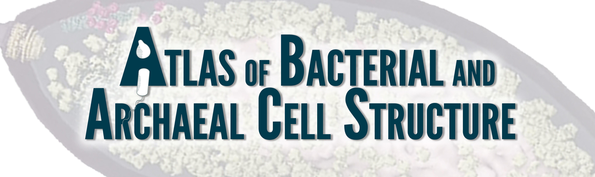

A visual tour of the microbial cell

# Coming Soon

Microscopy enabled by generous support from:

```{r logos, echo = FALSE}
knitr::asis_output(htmltools::htmlPreserve('
<div class="row">
  <div class="column">
    
  </div>
  <div class="column">
    
  </div>
  <div class="column">
    
  </div>
  <div class="column">
    
  </div>
  <div class="column">
    
  </div>
  <div class="column">
    
  </div>
</div>
'))
```
